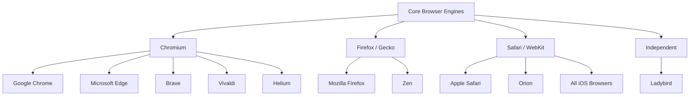

# State of Web Browsers: Theo's Deep Dive into Zen, Helium, and the Browser Wars

Theo has a notorious history of hopping between web browsers. After spending his early years on Firefox, he fully embraced Chrome, eventually transitioning to Arc after being pressured by his roommate. He fell in love with Arc's user interface and sidebar, but recently watched the project pivot and effectively die. This forced him to test over fifteen different browsers to find suitable replacements. 

Today, his setup relies on two distinct browsers for different purposes: Zen for content creation and presentation, and Helium for his daily development work. Through his journey, Theo has developed strong opinions on the current browser landscape, browser engine monopolies, and what actually makes a good web browsing experience.

To understand Theo's views on individual browsers, it is helpful to look at the underlying engines that power them. 

## The Chromium Titans: Chrome and Edge

Theo believes Google Chrome is genuinely an excellent piece of software and defends its impact on the web. Before Chrome, building websites meant writing specific, messy code to accommodate wildly different browsers. Google invested heavily in pushing open web standards because building desktop apps was a slow, painful process for them. They needed the web platform to win so they could ship software instantly through the browser. 

While people accuse Google of monopolistic behavior with Chrome, Theo argues Google simply built the best implementation of open standards. They give the Chromium core away for free because a better web means people spend more time on YouTube and Google services. 

However, Theo acknowledges that Google is currently acting monopolistically by forcing their Gemini AI into Chrome's interface. He finds the AI integration completely useless, noting it cannot truly interact with or scroll web pages, but merely takes screenshots to summarize. 

Theo also strongly defends Google's controversial push for Manifest V3 extension rules:
*   Many users believe Manifest V3 was an evil plot to kill ad blockers so Google could maintain ad revenue. 
*   Theo argues Manifest V3 was entirely about security, as Manifest V2 gave extensions deep, packet-level access that was constantly exploited by malware.
*   He cites personal experience having to wipe his sister's MacBook because a V2 Chrome extension hijacked her machine.
*   Ad blocking still largely works under Manifest V3 using blocklists, and while it might be slightly less robust, shutting down massive malware vectors was the right move for the web ecosystem.

Microsoft Edge is viewed as a solid, practical alternative. Microsoft built it on Chromium because maintaining Internet Explorer was a nightmare. Edge brings some nice UI additions like a sidebar, and because Microsoft does not rely heavily on an ad business, it is slightly less data-hungry than Google. 

## The Chromium Underdogs: Brave and Vivaldi

Theo is highly critical of Brave, primarily because of the deep friction it causes for users and developers. 
*   Brave's aggressive anti-fingerprinting and privacy shields constantly break modern web applications, causing severe headaches for developers like Theo. 
*   He heavily dislikes their user interface, specifically pointing out that their sidebar animations drop frames and fail to reclaim any vertical screen real estate.
*   He finds their persistent promotion of cryptocurrency features sketchy and refuses to recommend the browser to anyone.

Vivaldi served as Theo's temporary replacement for Arc due to its immense customizability, but it comes with caveats. 
*   A major misconception Theo points out is that Vivaldi is not actually open source; it is merely source-available and does not accept outside contributions.
*   While he appreciated the ability to configure custom hotkeys for his sidebar, the deep UI customization often led to random bugs. 
*   Ultimately, Vivaldi failed to give him back the vertical screen real estate he desires, as the top URL bar cannot be fully hidden safely.

## The Safari Ecosystem and Firefox Letdowns

Theo has a complicated relationship with Safari. While it is incredibly battery-efficient on Mac hardware, it is uniquely frustrating for web developers. Browsers like Firefox might render things poorly, but Safari actively crashes web applications due to deep backend issues, like race conditions in indexedDB. He also reminds viewers that every single browser on an iPhone or iPad is fundamentally just Safari forced into a different wrapper by Apple's rules.

He similarly dismisses Orion, a niche browser from the search engine company Kagi. He states it is simply a closed-source Safari wrapper with broken, bolted-on support for Chrome extensions, combined with bizarre onboarding screens. 

Firefox remains a sore subject for Theo. He has actively pushed their development team to fix massive, 15-year-old rendering bugs, such as their lack of gradient dithering. 
*   Mozilla recently altered their privacy policies, quietly removing guarantees that they would never sell user data.
*   Theo points out that Firefox largely exists because Google funds them. Google pays Mozilla massive sums to be the default search engine, primarily to avoid anti-trust scrutiny by ensuring a competitor stays alive. 
*   While Firefox technically works, Theo finds it relatively slow, battery-heavy, and clunky compared to modern Chromium alternatives.

## AI Browsers and the Ladybird Experiment

As companies pivot to AI, Theo has tested several "agentic" browsers with mostly negative results.
*   **Ladybird:** Theo notes this is not an AI browser, but an independent project building a browser from complete scratch. He stresses that Ladybird is not meant to be a daily driver or offer a better user experience. It is purely a technical experiment to prove a new browser engine can still be built today.
*   **DIA:** Created by The Browser Company after they gave up on Arc. Theo finds DIA completely useless, as it cannot even scroll down a webpage to read context. It only reads the immediately visible HTML, making it a severe downgrade from Arc.
*   **Comet:** Built by the AI search company Perplexity, Comet acts as a true AI agent. It can actually scroll pages, write Python scripts, and parse complex comment sections. However, Theo warns that agentic browsers like Comet are incredibly dangerous due to hidden prompt injections, where invisible text on a webpage can trick the AI into executing malicious actions.

## Theo's Top Picks: Zen and Helium

Theo currently relies exclusively on two open-source browsers cultivated by small, passionate development teams who actually care about UX.

**Zen Browser** is Theo's favorite browser for content creation, browsing, and aesthetics. 
*   It is built on top of Firefox but features a completely redesigned, calm interface heavily inspired by Arc.
*   It handles vertical screen real estate perfectly and features the best sidebar implementation Theo has ever used, allowing placement on the right side of the screen.
*   It includes workflow essentials, like Theo's mandatory `Cmd+Shift+C` shortcut to instantly copy the current URL without navigating to a top bar. 
*   Because it relies on Firefox, it does suffer from poor developer tools and higher battery drain, but Theo has invested his own money to support the developers because he believes in their vision.

**Helium** is Theo's daily driver for heavy development work.
*   Created by the developers behind Cobalt, Helium relies on the Chromium engine but strips away Google's tracking. 
*   The architecture is utterly unique: the codebase is essentially a massive set of C patch files applied directly over the Chromium source code.
*   It is aggressively private. For example, when installing a Chrome extension, Helium downloads it through their own infrastructure so Google never knows what extensions you are running.
*   The developers are obsessed with UI polish, managing to shave pixels off the top URL bar to provide more vertical real estate than standard Chrome.
*   While it lacks features like cross-device tab syncing (a feature Theo personally thinks is useless anyway) and native vertical tabs, it is incredibly fast, stable, and recently introduced builds for Windows and Linux alongside macOS.
