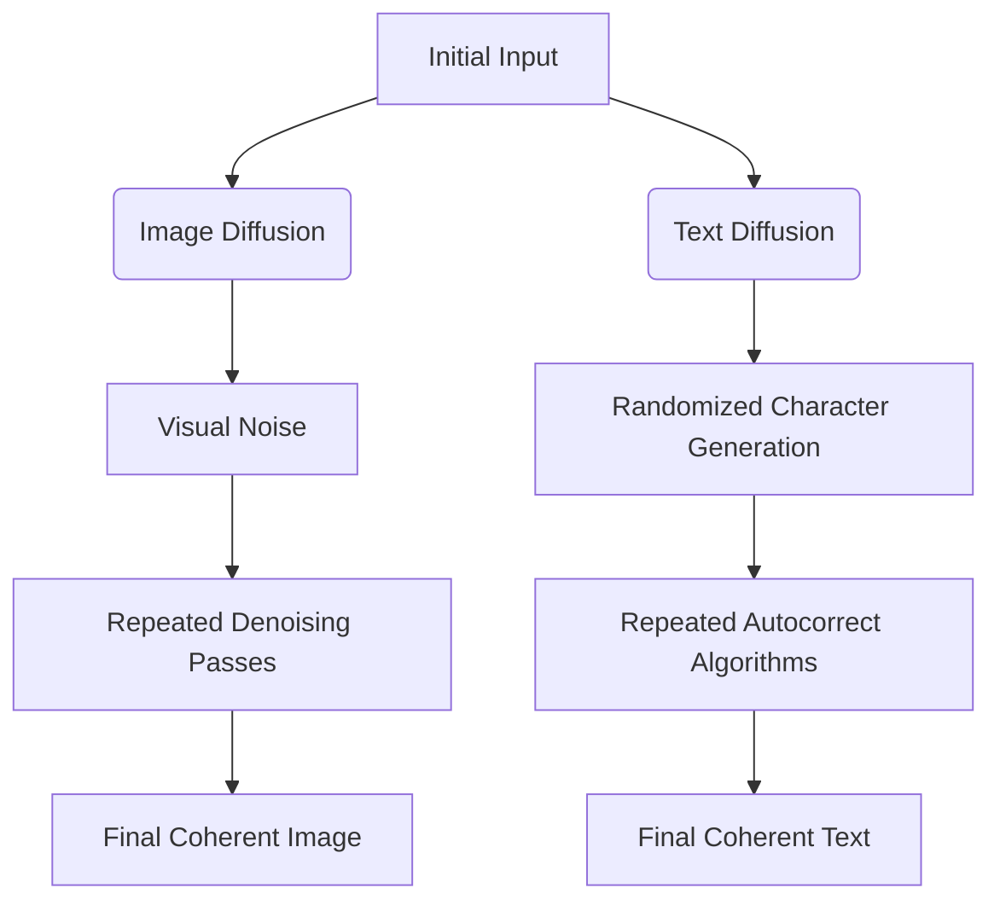

# Theo's Breakdown of Google's Latest AI Announcements

Theo recently dove into a massive wave of announcements from Google regarding models, hardware, video generation, and extended reality. He notes that while Google's technology is achieving incredible benchmarks, their user experience and product messaging still suffer from distinct growing pains. Before getting into the deep technical analysis, he briefly highlighted Savala (a Kinsta product) as a highly recommended hosting platform, particularly for non-JavaScript developers who want an easy, integrated dashboard for servers, CDNs, and cron jobs.

Here is a detailed breakdown of the major highlights, opinions, and technical shifts Theo uncovered.

### Gemini Models and the Power of TPUs
Google continues to iterate on its Gemini ecosystem, but Theo has mixed feelings about their current model lineup and their marketing strategies. 

*   Google teased a "Deep Think" Gemini model within the 2.5 ecosystem that heavily outperforms competitors in coding benchmarks (like USMO), though it is currently delayed for safety evaluations.
*   Theo considers Gemini 2.5 Flash to be a disappointing value compared to 2.0 Flash, noting that it costs significantly more without a proportionate bump in quality, and becomes as expensive as competitors like OpenAI's 4o-Mini when reasoning capabilities are turned on.
*   He openly criticized Google's fragmented presentation slides, where a speaker clumsily claimed their model had 24 times higher intelligence per dollar than GPT-4o, but immediately followed up by noting it was only five times higher than DeepSeek R1.
*   Theo argues that Google's true competitive moat is hardware. They announced the "Ironwood" TPU, boasting 42.5 exaflops of compute, immense memory bandwidth, and 30 times the power efficiency of their 2018 chips. 
*   Because Google owns the full pipeline from hardware to the final API, advancements in their proprietary TPUs uniquely make Gemini faster and cheaper, whereas advancements from chipmakers like Nvidia benefit the entire AI industry equally.

### Model Transparency and Text Diffusion
According to Theo, Google is finally shifting its architecture and its developer philosophy, adopting ideas that open-source models pioneered.

*   Following the standard set by DeepSeek R1, Google has completely reversed its stance on obfuscating AI reasoning and is now exposing the raw "thinking" data over their API for all developers, rather than keeping it locked behind exclusive partnerships.
*   Google debuted an experimental Gemini Diffusion model specifically built for text, achieving mind-bending speeds of around 1,000 tokens per second.
*   Theo tested this diffusion model by tasking it to port Advent of Code solutions from Rust to JavaScript, proving it could generate and perfectly translate complex code almost instantaneously.
*   He finds this approach fascinating because diffusion is traditionally reserved for images, but Google has successfully adapted the underlying logic to language iteration.

### Video Generation and Android XR
Google is pushing heavily into multimedia generation and hardware, though Theo found the interfaces incredibly frustrating compared to the actual output quality.

*   Google released Veo V3, their highest-quality model for generating video and synced audio, though accessing it requires an expensive $250-a-month subscription.
*   Theo experienced terrible user experience on Google's backend while testing Veo, citing slow load times, poor state management, unresilient streaming, and hallucinated audio that mismatched the video entirely.
*   Despite his frustrations with the interface, Theo concedes that Veo V3 produced visually superior outputs compared to competitors like Sora and Kling. Google successfully generated an anatomically correct laptop screen without bleeding computer code into the background of the image, a common failure in other models.
*   Google also teased Android XR running on lightweight AI glasses. As a VR enthusiast who loves the Apple Vision Pro, Theo is skeptical of Google's approach. Based on the demos, Google's glasses seem to feature a fixed screen that moves with the user's head, entirely lacking the spatial anchoring necessary to make digital windows feel like physical objects in the real world.

Ultimately, Theo walked away highly impressed by Google's raw technical capabilities and hardware scaling, even ending on a humorous note by displaying a leaderboard showing the word "Gemini" was said 95 times during the presentation.
