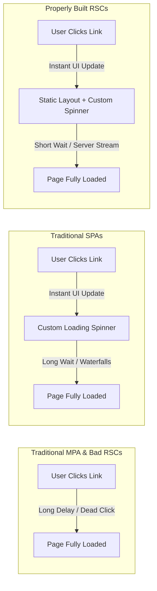

# The Core Problem with React Server Components (and How to Fix It)

Theo notes that many React Server Component applications currently in the wild feel remarkably slow to use, often suffering from full-second delays during navigation. While prominent voices in the community blame the technology itself or its overhead, Theo argues that the fault lies mostly with developers who do not deeply understand how Server Components behave under the hood. The goal is to achieve the high performance of server-rendered sites while maintaining the excellent developer and user experiences expected from modern tools, but getting there requires unlearning some old habits.

Before diving into Server Components, Theo outlines how web rendering has evolved to explain our current user experience expectations. Originally, Multi-Page Applications (MPAs) required the browser to ask the server for a full HTML page on every single interaction. This framework created a massive delay between a user clicking a link and actually seeing a response, leaving them staring at an unresponsive screen while the server did its work.

Single Page Applications (SPAs) fundamentally shifted this model. In an SPA, the server sends a single, empty HTML file containing a JavaScript bundle. Once loaded, the JavaScript intercepts all routing natively in the browser. When a user clicks a link, the UI updates instantly, and data is fetched dynamically. While this setup means the initial page load might be slow due to data-fetching waterfalls upon component mount, the perceived performance during navigation feels incredibly fast because the client provides immediate visual feedback. 

Server Components aim to combine these paradigms, but they introduce significant user experience issues if developers lack a strong grasp of server behavior. 
*   If you build a Server Component application without explicit loading limits, the application essentially defaults to the old MPA-style routing.
*   When a user clicks a link in this flawed setup, the browser must wait for a full round-trip to the backend to generate and return the new page content before showing the user anything.
*   This causes a "dead click"—a scenario where the user interacts with a button and nothing visibly happens for hundreds of milliseconds, which makes the app feel entirely unresponsive.
*   Theo points out that human psychology dictates UI responses under 100 milliseconds feel instantaneous, while delays approaching a second break a user's flow of thought and focus.

To fix this sluggishness, Theo demonstrates how to implement proper barriers and loading boundaries inside Next.js. If a page requires dynamic, user-specific data, the framework cannot generate it entirely at build time. The developer must intentionally separate the static outer UI from the dynamic inner content.

The easiest way to achieve the optimal setup is to use a `loading.tsx` file or wrap dynamic components in a `<Suspense>` tag. By doing this, you instruct the Next.js compiler to build a static outer shell for the layout that includes a fallback loading state. When an interaction occurs, Next.js instantly serves that static shell and displays the localized loading UI, granting the user the immediate feedback typical of an SPA. Meanwhile, the server processes the dynamic content asynchronously and streams it into the shell once it is ready. Theo mentions that experimental features like Partial Pre-rendering (PPR) and Dynamic IO will eventually make this optimal routing style the default out of the box.

### The Developer Divide and UX Philosophy

Theo addresses the growing divide between frontend and backend developers regarding how web applications should handle these loading states, pointing out that both groups have blind spots.

*   Backend developers and advocates for tools like HTMX often argue that developers should skip custom spinners and simply rely on the browser's native loading bar to indicate progress.
*   Theo strongly disagrees with relying on the browser, arguing that native loading indicators are located far away from the user's cursor and offer a terrible user experience that often leads to confused "rage clicking."
*   Conversely, frontend developers rely too heavily on generating every UI layout purely on the client, which forces multiple slow, sequential network requests that severely bog down the overall time to fully render the page.
*   Theo concludes that properly built Server Components hit the ultimate sweet spot: they deliver the fast data retrieval of an MPA alongside the immediate, interactive visual feedback of an SPA, provided the developer takes full control of the loading state.
