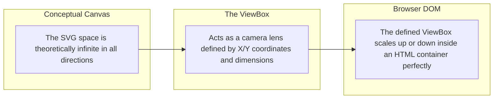

# Unlocking the Power of SVGs: A Deep Dive with Theo

Theo loves SVGs for their ability to deliver infinitely scalable graphics using tiny amounts of data, but he admits he has always felt intimidated by them. He usually relies on design software to generate them and struggles to write or animate them by hand. Finding that AI is also notoriously bad at generating SVGs, Theo decides to finally master the fundamentals by extensively reviewing a technical guide written by developer Josh Comeau. 

Theo highly respects Comeau's educational resources, noting that his interactive courses on CSS and React are legendary. He suggests that developers should use their company education budgets to support Comeau's work. 

Before diving into the technical details, Theo briefly pauses to highlight a tool called Mobbin. He uses it when developing apps—like a mobile interface for his T3 chat—to find high-quality design inspiration by searching a vast database of existing app screens. 

### Why Native SVGs Are So Powerful

Theo explains that while SVGs can be used in standard image tags like JPEGs, their real magic unlocks when they are written inline within an HTML document. Because SVGs are written in an XML syntax similar to HTML, they act as first-class citizens in the Document Object Model (DOM). 

This means developers can use standard CSS and JavaScript directly on the individual lines and shapes that make up an illustration. You can attach user interactions like hovers or focus states to an SVG node, and transition its color, size, and position just like any standard web element. Theo is blown away by how easy it is to smoothly transition a shape's size and color natively without needing external animation files.

Theo notes that while design software like Figma or Illustrator can export SVGs, they often mash the entire image into a single, complex path. This approach makes animating individual parts of the illustration incredibly difficult. By learning to write the basic primitives by hand, developers unlock the ability to target and animate specific pieces of the graphic.

### SVG Primitives and The Infinite Canvas

Theo explores the basic shape concepts built into the SVG specification. He contrasts this with standard CSS, noting how difficult it used to be to create diagonal lines or hand-drawn borders in HTML—referencing a specific struggle he had when trying to build jagged buttons for a Dogecoin simulator game. 

*   Lines allow you to define exact start and end coordinates, completely eliminating the need to use CSS rotation and complex math to draw a diagonal line.
*   Rectangles require X and Y positioning along with width and height, but Theo highlights a crucial difference from standard CSS: SVG strokes are drawn from the dead center of the line, expanding equally outward and inward, rather than adhering to standard HTML box-sizing rules.
*   If a two-dimensional shape like a rectangle or an ellipse has its width, height, or radius reduced to zero, it disappears entirely rather than rendering as a straight line—a state the specification humorously refers to as a "degenerate" shape.
*   Circles and ellipses use center-point origin coordinates rather than standard X and Y start points, which changes the math required to position them next to rectangular elements.
*   Polygons are built using a raw list of X and Y coordinate mapping points. Theo agrees with Comeau that developers should use commas and new lines to format these points cleanly; browsers ignore the extra spacing, and modern gzip compression ensures the file size remains completely unaffected.

Theo finds the concept of the `viewBox` particularly mind-expanding. If you define an SVG using absolute pixel coordinates, standard container resizing will crop the image. The `viewBox` completely prevents this. 

As illustrated above, there are no actual edges to an SVG canvas. You can place a shape a million pixels away from the center. The `viewBox` serves as a camera viewport, essentially telling the browser which specific rectangle of that infinite space to show to the user. Because the drawing instructions are vector-based, changing the size of the `viewBox` acts exactly like a browser zoom function, scaling the vectors endlessly without ever losing graphical fidelity.

### Mastering Strokes and Animation

The absolute highlight for Theo is discovering the depth of customization available for SVG strokes. He learns that properties can be applied both inline and via CSS, making them highly flexible.

*   By using the `stroke-dasharray` property, you can pass a list of values to determine exactly how long a painted dash should be, followed by how long the empty gap between dashes should be. 
*   Theo discovers an intriguing edge case regarding zero-width lines: if you set a dash length to zero but leave the line cap style as default, the dot entirely disappears; however, applying a square or round cap forces a dot to render that uniquely aligns with the page rather than the stroke's angle.
*   The `stroke-dashoffset` property allows developers to seamlessly slide these customized dashes around a shape's perimeter, which is the exact mechanism used to create modern, lightweight spinning loading icons.
*   To create the illusion of an illustration drawing itself, a developer specifies a single dash and gap that are identical in length to the entire circumference of the shape. By animating the offset from the full length down to zero, the line appears to seamlessly pull itself into existence.
*   To find that exact circumference length, developers can either use a built-in Javascript length-measuring function, trial and error, or hack the HTML `pathLength` attribute to arbitrarily force the browser to treat the total length as 100.

Theo concludes the breakdown feeling far more confident in his ability to write, format, and animate SVGs natively. He highly recommends checking out Josh Comeau's upcoming course on animations to explore the deeper capabilities of these graphics.
