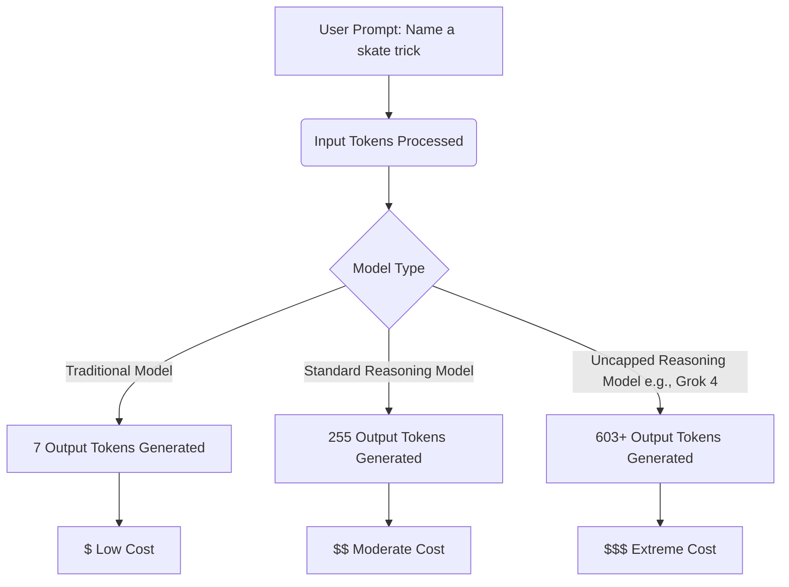

# The Hidden Cost of AI: Why Cheaper Tokens Don't Mean Cheaper Models

Theo recently realized that his previous prediction about AI models entering a pricing "race to the bottom" was completely wrong. While it looks on paper like token prices are dropping rapidly across the industry, the actual cost to run modern AI models has skyrocketed. By running his own custom benchmark, Theo discovered a massive discrepancy between advertised token prices and the actual cost of generating answers, a realization that has deep implications for the future of AI software companies.

### The Reasoning Explosion

The core issue driving up costs is the shift toward "reasoning" models. When you send a prompt to an AI, you are charged for input tokens, which are relatively cheap, and output tokens, which are significantly more expensive. In the past, a brief question resulted in a brief, inexpensive answer. Today, reasoning models process a prompt by generating thousands of hidden "thinking" tokens before outputting a final answer. 

Theo demonstrated this using his "skatebench" test, where he asked different models to name a skateboarding trick based on a description. A traditional model answered in just seven output tokens. Claude 4 with reasoning turned on gave the same short answer but generated 255 tokens in the background. Grok 4 took this to an extreme, generating 603 tokens of pure reasoning while repeatedly outputting the word "thinking" without letting the user cap the budget. As a result, running the benchmark on Grok 4 cost Theo 30 times more than using Claude without reasoning, and 100 times more than OpenAI's more efficient o3 model. 

### The VC Pricing Trap and Consumer Behavior

Theo highlights a prevalent but flawed venture capital strategy: charging users a flat $20 a month while taking a loss, under the assumption that compute costs will drop by ten times next year and eventually yield massive profit margins. This strategy ignores two fundamental aspects of human behavior and technological advancement.

*   Consumers suffer from "cognitive greed," meaning they will always demand access to the absolute smartest, most expensive state-of-the-art model rather than settling for a cheaper, older version to save the company money.
*   When developers give users the option to control the AI, users will maximize the settings, which Theo learned firsthand when he gave T3 Chat users a reasoning toggle and watched them continuously select "high," inexplicably tripling his infrastructure costs.
*   The length and complexity of tasks an AI can handle is doubling every six months, meaning workflows have shifted from simple text generation to autonomous agent loops that can run for 20 minutes straight.
*   A user initiating a single deep research task can burn through a dollar of compute in one run, making a $20 flat monthly subscription mathematically impossible to sustain for power users.

To illustrate how perilous this environment is, Theo points to Anthropic's recent attempt to launch an unlimited $200 a month tier for their Claude Code product. Despite using brilliant engineering tricks like autoscaling models based on load and offloading processing to the user's local CPU, Anthropic still got obliterated by power users. Because Claude Code utilizes autonomous loops, users were setting it to refactor code 24/7, with some individuals racking up over $35,000 in inference costs in a single month. Anthropic had to kill the unlimited tier because flat-rate subscriptions simply cannot survive in a world where AI operates asynchronously.

### Three Paths Forward for AI Companies

Because consumer AI companies are trapped in a prisoner's dilemma where they must offer unsustainable flat rates to compete with VC-funded rivals, the entire industry is staring down a wave of bankruptcies. Theo reviews three potential strategies companies can use to escape the death spiral.

*   Companies can rely on usage-based pricing from day one to ensure honest unit economics, though this historically stunts growth because consumers universally prefer flat-rate subscriptions over metered billing.
*   Businesses can target massive enterprise agreements, such as integrating AI into legacy banks, where long sales cycles and high bureaucratic switching costs guarantee high margins and zero churn once the contract is signed.
*   Developers can use AI inference as a loss leader while vertically integrating their platform, capturing revenue by selling the necessary hosting, database management, and deployment tools that AI-generated code naturally requires.

Theo is currently betting on this third path for T3 Chat. He believes that surviving the current AI landscape isn't about hoping the models get cheaper, but about building an ecosystem so useful that the cost of inference becomes just another manageable marketing expense.
