# The Vercel vs. Cloudflare "Just-Bash" Drama Explained

The ongoing rivalry between Vercel and Cloudflare recently flared up over a surprisingly specific piece of technology: a package called `just-bash`. Theo breaks down the technical reasons behind the package, the conflicting architectures of the two companies, and how a genuine attempt to experiment escalated into a public feud.

### What is Just-Bash and Why Does it Matter?
Built by Malte, the CTO of Vercel, `just-bash` is a virtual bash environment with an in-memory file system written entirely in TypeScript. It was designed specifically for AI agents. 

When AI agents are tasked with navigating codebases or executing commands, giving each agent its own actual Linux virtual machine is expensive and potentially dangerous. By creating a simulated bash environment that runs safely inside a JavaScript virtual machine, developers can let AI agents operate flexibly without the overhead or security risks of a real operating system. Both Vercel and Cloudflare recognized how incredibly useful this is for the future of AI development, but they needed it for completely different reasons.

### The Conflict
The drama began when a Cloudflare engineer forked Vercel's `just-bash` project and published it to the official Cloudflare npm repository under the name `@cloudflare/shell`. Because Cloudflare had previously forked Vercel's Next.js (creating a Vite-based version with significant security vulnerabilities), Vercel leadership was already on edge. 

Malte published a highly critical article about the fork, and Vercel's CEO Guillermo Rauch accused Cloudflare of trying to destroy open source. Theo outlines Vercel's specific grievances regarding the fork:

*   Forking a brand new, highly experimental "beta" project without attempting to contribute to the original repository violates standard open-source etiquette.
*   Cloudflare removed the beta disclaimers and security warnings from the documentation, making the tool look deceptively production-ready.
*   The fork swapped out a secure Python implementation for Pyodide in a way that allows the Python program full access to the JavaScript host, creating a massive vulnerability.
*   Cloudflare stripped out crucial "defense-in-depth" security layers, such as disabling `eval` and preventing prototype pollution, which are necessary to stop AI models from breaking out of the sandbox.

### The Architectural Divide
To understand why Cloudflare stripped out these security features, Theo explains the fundamental differences in how Vercel and Cloudflare host applications. 

Vercel operates closer to a traditional server model. Each deployment effectively runs in its own Docker container with a Node.js runtime. In Node, it is remarkably easy to execute commands directly to the native Linux shell. If an AI agent were given access to real bash on Vercel, it could potentially break out of its environment, access environment variables, or interfere with other requests. Therefore, Vercel built `just-bash` with heavy security layers built on top of Node to trap the agent at the highest possible level and prevent it from reaching the real operating system.

Cloudflare, however, uses `workerd`, a V8-based runtime that handles incoming requests by spinning up isolated JavaScript environments (isolates). The operating system and runtime are shared across different developers, but the strict isolation prevents user code from accessing the underlying machine. 

```mermaid
flowchart TD
    subgraph Vercel Environment
        V_Agent[AI Agent / User Code]
        V_JustBash[Just-Bash Fake Shell]
        V_Node[Node.js Runtime]
        V_Linux[Native Linux Shell / OS]
        
        V_Agent -->|Contained safely by| V_JustBash
        V_JustBash -->|Runs on| V_Node
        V_Node -.->|Potential dangerous access| V_Linux
    end

    subgraph Cloudflare Environment
        C_Agent[AI Agent / User Code]
        C_CFShell[Cloudflare Shell Fork]
        C_Isolate[workerd V8 Isolate]
        C_OS[Shared Cloudflare OS]
        
        C_Agent -->|Uses| C_CFShell
        C_CFShell -->|Runs securely inside| C_Isolate
        C_Isolate -.->|Hard hardware barrier| C_OS
    end
```

Because Cloudflare's runtime natively isolates requests and inherently lacks the ability to execute real bash commands, Vercel's Node-specific security layers were completely unnecessary and largely incompatible. Cloudflare didn't need the security features; they just needed the simulated bash environment so their AI agents could use bash commands on a platform where bash doesn't actually exist.

### A Problem of Communication and Assumptions
Theo steps in to defend Sunil Pai, the Cloudflare engineer responsible for the fork. Theo explains that Sunil is a highly respected, positive force in the web community who simply wanted to get this exciting technology working for Cloudflare's AI agents. 

Sunil likely used an AI to help strip the package of its Node-specific code to make it compatible with Cloudflare's runtime. However, he made a critical mistake by publishing it directly to the official Cloudflare repository without adding context, experimental tags, or security warnings. Because AI generated much of the code changes and readme updates, crucial context was lost, resulting in a package that looked like a malicious, unsafe corporate clone rather than a weekend experiment.

Theo argues that while Sunil made a mistake in how he published the code, Vercel made a massive misstep in their reaction. Because past tensions between the companies had eroded trust, Vercel assumed bad faith immediately. Instead of simply sending a private message to Sunil to clarify the situation, Vercel took the issue highly public, resulting in unnecessary drama.

Ultimately, Malte deleted his critical article and issued a public apology to Sunil. He acknowledged that he caused unnecessary pain, recognized Sunil's positive track record in the community, and admitted he should not have escalated the situation. Theo concludes the video by pleading with the leaders of both companies to remember their shared humanity and simply text one another before publishing aggressive blog posts.
