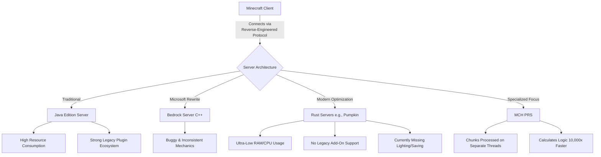

# The Renaissance of High-Performance Minecraft Servers

Theo begins by sharing how deeply foundational Minecraft is to his tech career, noting that the time he spent hosting servers in high school led him to become a developer and eventually work at Twitch. However, he is incredibly frustrated by the current state of default Minecraft server hosting. He points out that traditional Java servers remain massive resource hogs, and he firmly rejects Microsoft's C++ "Bedrock" rewrite, arguing that it is riddled with bugs, features weird behaviors, and fundamentally fails to replicate the true Minecraft experience.

To solve this, a dedicated community has been building alternative servers, and Theo spends the video exploring this high-performance renaissance. 

### The Pumpkin Project

Theo is highly enthusiastic about a new open-source server project called Pumpkin, which is written entirely in Rust. He details the massive performance leaps this architecture provides over traditional Java servers:

*   Pumpkin delivers a staggering 100x reduction in memory and a 20x reduction in CPU usage, running 10 players on merely 27 megabytes of RAM and 1.5% CPU compared to Java's 2 gigabytes and 24% CPU.
*   The developers explicitly refuse to pursue compatibility with existing legacy plugin frameworks like CraftBukkit or Fabric, designing Pumpkin strictly as a standalone, ultra-fast experience rather than a modular baseline for other developers.
*   Because the project is still a work in progress, it entirely lacks expensive operations like world saving, world borders, and dynamic light recalculation, meaning player-placed blocks do not currently emit or block light.
*   Theo verifies these claims by cloning and running Pumpkin locally on his machine, where he is stunned to see the server idle at exactly 0% CPU and just 4 megabytes of RAM—a stark contrast to the standard 8 gigabytes he usually sets aside for Java servers.

Creating alternative servers like Pumpkin is a monumental technical achievement. Because the official Minecraft server code is completely closed-source, developers rely on over a decade of community reverse-engineering to recreate every specific data type, server request, and block state update entirely from scratch.

### Revolutionizing Redstone Logic

Theo initially assumes that complex Redstone logic and programmable command blocks are the ultimate bottleneck for these custom servers. Because Minecraft effectively runs as a server even in single-player, every single logic gate and automated farm has to be calculated server-side.

However, his live chat corrects this assumption by pointing him toward MCH PRS (Minecraft High Performance Redstone Server). 

*   MCH PRS is an optimized server built explicitly to handle massive Redstone calculations by isolating 256x256 world plots onto completely separate CPU threads. 
*   Theo watches community footage highlighting the power of this threading, including a fully functional port of Pokémon Red and Blue, and an instance of someone literally building a working version of Minecraft inside the game using blocks.
*   These megaprojects are only possible because MCH PRS processes the game's logic over 10,000 times faster than vanilla Minecraft, which would otherwise render these elaborate machines at a rate of one frame every few days.

Ultimately, Theo concludes that we are in a new era for Minecraft hosting. While he notes that the fracturing of mod and plugin ecosystems can make setting up specific environments annoying, he is incredibly excited by the raw hardware efficiency developers are achieving through modern languages and protocol reverse-engineering.
