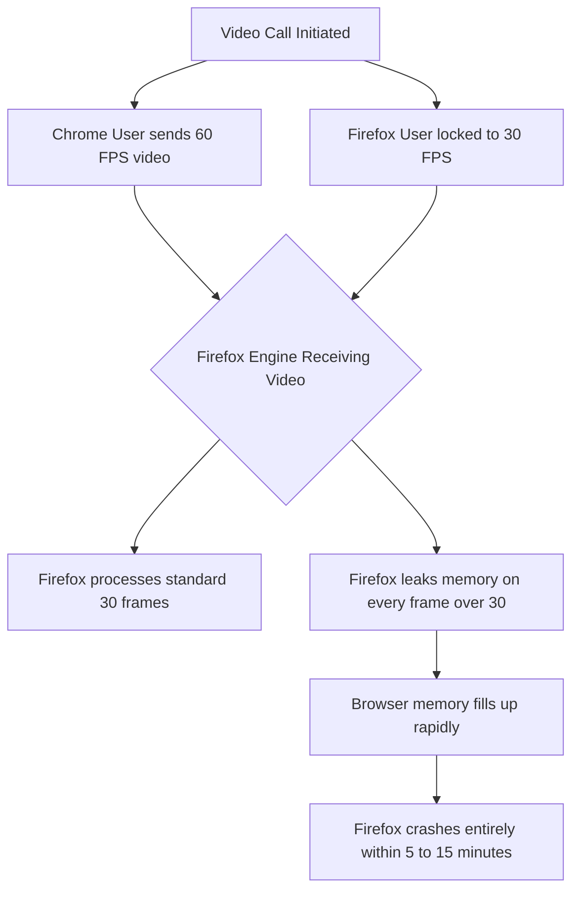

# Theo's Frustrations with the Current State of Firefox

Theo recently transitioned away from the Arc browser, choosing to daily-drive Zen, a browser built on the Firefox engine. While he explicitly praises the team behind Zen for building a caring and highly responsive product, using a Firefox-based browser every day has reinvigorated his deep frustration with Mozilla's underlying engine. Theo notes that he used to love Firefox for fundamentally changing the web during the era of Internet Explorer, but he believes that users defending its current state are disconnected from the reality of modern web development and computing. 

During the video, Theo briefly mentions his own app, T3 Chat, which he built to be a highly fast and stable AI interface using Azure and models like DeepSeek. Building and debugging modern tools like this is exactly what led him to uncover a multitude of fundamental flaws in how Firefox operates compared to Chromium-based browsers. 

### Development and API Limitations

When Theo attempted to do actual developer work inside Firefox, the tools actively hindered his ability to build modern applications. He found core browser standards simply missing or completely broken when debugging.

*   When making standard web requests in Firefox, the request body does not behave locally as a readable stream the way it does in Chrome, causing unnecessary friction for developers working closely with APIs.
*   The DevTools in Firefox fail to support HTTP streaming, meaning that if a developer is waiting on a long streamed response, they cannot see the data populate in real-time and must wait for the entire transmission to finish before debugging.
*   Because modern AI applications rely heavily on real-time streaming interfaces, this limitation renders Firefox's developer tools objectively useless for his daily professional workload.

### Lagging Web Standards and Rendering Issues

Theo argues that the primary reason Google initially built Chrome was to push the web forward when Firefox was moving too slowly. Today, he feels Firefox is doing the exact same thing, often lagging behind even mobile browsers like Samsung Internet in adopting modern web standards. 

*   Firefox is the only major browser right now not attempting to support CSS container queries, an incredibly useful modern styling tool.
*   The browser completely lacks support for CSS view transitions, a standard that allows developers to easily create smooth, native-feeling morphing animations between page loads without writing heavy custom code.
*   Firefox suffers from atrocious color banding when rendering CSS gradients, an issue so severe that Theo has to write custom code to serve completely flat backgrounds to Firefox users.
*   The dithering and gradient rendering bug in Firefox has been an open issue on their tracker for 14 years with no resolution, underscoring Mozilla's failure to address core visual features.

### The WebRTC and Video Streaming Disaster

One of Theo’s most serious encounters with Firefox’s limitations occurred when building Ping, a high-quality video collaboration tool designed for live streamers. Because his tool targeted a professional audience, Firefox presented catastrophic, unfixable bugs that forced him to block the browser entirely.

Because Firefox on Apple Silicon did not support certain codecs and strictly locked users' broadcast framerate to 30 frames per second, the engine could not handle mismatched framerates in a shared call. It is entirely unacceptable to Theo that a browser used by professionals cannot handle playing or creating a basic 1080p, 60fps video track without fatally crashing. 

### Market Share Reality and Battery Life

Theo points out a massive discrepancy between the people who claim to defend and use Firefox and the actual browser analytics on modern websites. While online polls often show up to half of tech-savvy audiences claiming to use Firefox, actual metrics from his sites show the adoption rate is closer to 15 to 18 percent. He suggests many users simply claim to use Firefox out of ideological loyalty to open-source software, rather than actually relying on it daily.

Finally, Theo tested battery life across several browsers on his high-end Apple M2 laptop to see how Firefox compared. The Arc browser performed the worst at roughly two hours of battery life. Zen and Firefox doubled that, yielding about four hours of battery. However, Vivaldi, a Chrome-based browser, surprised him by delivering an impressive ten hours of battery life. While Safari also offered decent battery life, Theo noted that Safari suffers from terrible implementations of indexDB, adding that handling indexDB correctly is the one area where Firefox actually performs perfectly.

Ultimately, Theo’s harsh criticism of Firefox does not stem from a hatred of open-source software, but from a genuine desire to see the web function correctly. He intends to continue daily-driving the Zen browser to support its talented developers, utilizing his platform to spotlight these deeply rooted, 14-year-old bugs in the hopes that Mozilla is finally pressured to fix them.
