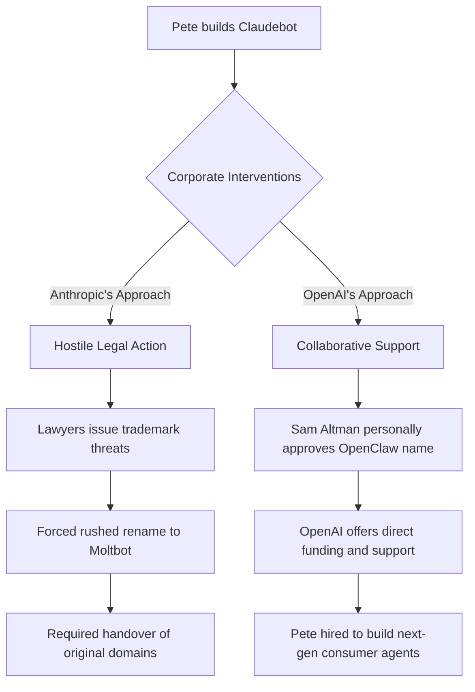

# The Evolution of OpenClaw and Pete's Move to OpenAI

Theo breaks down a massive development in the AI industry: Peter Steinberger, the creator of the wildly popular open-source project OpenClaw, has just been hired by OpenAI. Rather than being a simple acquisition, this move reveals a lot about the current landscape of AI development, the contrasting philosophies of major AI labs, and what it takes for independent builders to thrive. 

Theo explains that OpenClaw is an AI agent that runs entirely locally on a user's machine, possessing deep, systemic access to applications like iMessage, Gmail, and local network storage. Users can text the agent via WhatsApp or Telegram to execute complex computer tasks remotely. While this requires bypassing standard safety permissions—making it inherently dangerous if set up incorrectly—the sheer power of the tool caused it to become the fastest-growing GitHub project of all time, rapidly outpacing massive projects like Next.js and Kubernetes in stars.

The success of the project is deeply tied to Pete's unique background. After selling a successful iOS PDF company, Pete took a five-year hiatus from computers. This break allowed him to completely skip the early iterations of autocomplete coding tools. When he returned, he jumped straight into advanced AI coding workflows, heavily utilizing concurrent terminals, queuing features, and direct-to-main commits without relying on traditional checkpointing. 

### The Clash of Corporate Philosophies

As OpenClaw (originally named Claudebot) gained traction, Pete had to navigate the vastly different approaches of the industry's top players. Theo uses Pete's experience to highlight his own strong arguments regarding how Anthropic and OpenAI interact with the developer community.

Theo argues that Anthropic operates with a closed, defensive, and often hostile mindset toward developers. He points out that instead of embracing a project that heavily utilized their models, Anthropic's lawyers aggressively forced Pete to change the project's name and hand over his domains. Furthermore, Theo criticizes Anthropic for filing DMCA takedowns against developers who published open-source maps, banning users who utilize their API subscriptions on third-party interfaces, and stubbornly refusing to adopt open community standards for agent file structures.

In stark contrast, Theo champions OpenAI as a collaborative and open-minded partner for developers. When Pete secured the name OpenClaw, he called Sam Altman, who gave the name his blessing. Theo notes that OpenAI actively open-sources tools like the Codex CLI, encourages users to utilize their API subscriptions across various third-party platforms, and readily shares early access with builders. While Theo acknowledges that some viewers accuse him of being a paid shill for OpenAI, he firmly denies this, noting he pays tens of thousands of dollars a month for their API and simply praises them because they treat developers with respect and transparency.

### Why Pete Chose OpenAI

Ultimately, Pete had options, including interest from Meta, but his decision to join OpenAI was driven by a desire to build rather than to manage. Based on his conversations with Pete and Pete's official announcement, Theo outlines the reasoning behind the transition:

* Pete is already independently wealthy from his previous startup and was comfortably funding OpenClaw's server costs himself, meaning this decision was about finding the right environment rather than chasing a payday.
* Having spent 13 years running a startup, Pete has no desire to be a CEO again; he wants to avoid the suffocating administrative burdens, legal stresses, and investor obligations that come with running a company.
* Operating inside OpenAI provides him with top-tier stability, legal protection, and access to unreleased frontier research, allowing him to focus entirely on engineering and changing the world.
* The cultural alignment and positive vibes at OpenAI made it the clear choice, as they matched his vision and agreed to support OpenClaw as an independent open-source foundation.

Moving forward, Pete will not just be working on OpenClaw at OpenAI. He has been hired to build an entirely new, highly accessible personal agent designed so that anyone—even a non-technical user—can utilize it effortlessly. Meanwhile, OpenClaw will live on as an independent foundation supported by OpenAI funding, ensuring the community retains a space to hack, experiment, and own their data. 

Theo concludes that Pete’s journey is a massive win for independent developers, proving that individual builders who ship consistently can still create movements so impactful that the biggest AI labs in the world have no choice but to support them.
