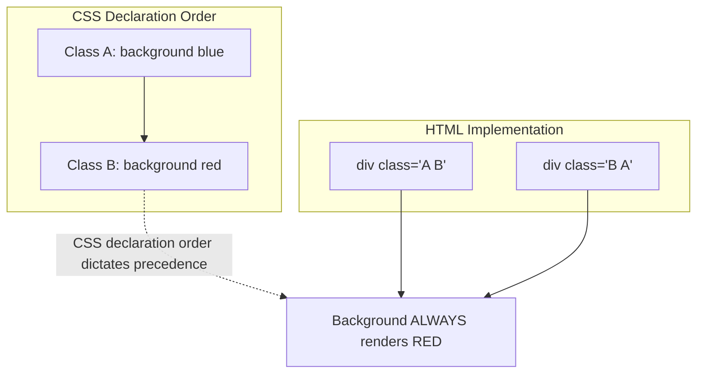

# Why Tailwind CSS is the New Default

Theo openly admits that he has submitted to Tailwind CSS, viewing it as the undeniable standard in modern web development. While he initially hated the framework, he explains that once Tailwind clicks for a developer, its advantages become difficult to ignore. He frames Tailwind as the new React: for 95% of users, it provides an experience that is as good or better than whatever they were using before. The remaining 5% experience friction because they require hyper-custom style systems or dynamic state behaviors, which Tailwind fundamentally is not designed to handle without external tooling. 

Theo notes that while React adopted Tailwind relatively late, its massive early adoption was actually driven by the Vue, Laravel, PHP, Elixir, and Ruby on Rails communities. Today, it has spread so far that it is the backbone of most AI code-generation tools, email frameworks like Resend, and is making deep inroads into React Native via NativeWind. 

### The Drama and Vercel's Involvement

Theo addresses a recent debate sparked by the creator of Tamagui, who suggested Vercel forces a Tailwind narrative merely to sell Server Components and Turbopack. Theo pushes back hard against this, dismantling the conspiratorial angle and highlighting the practical realities of infrastructure. Vercel CEO Guillermo Rauch did not invest in Tailwind out of a desire for world domination; rather, CSS-in-JS libraries were poorly suited for React Server Components and caused significant friction. Tailwind was adopted by Vercel because it naturally solved these architectural bottlenecks, scaling well dynamically without generating conflicting code. 

### Why Tailwind Succeeds Technically

Theo outlines several core technical reasons why Tailwind has earned its status as the default styling solution, even when developers have reservations about crowded HTML syntax:

*   **Massive minification benefits:** While HTML elements become packed with utility classes, the actual underlying CSS file is incredibly small because a rule like `display: flex` is only written once in the entire application. Minifying a long string of repeating Tailwind classes in HTML requires far fewer tokens than minifying thousands of custom CSS classes, leading to better overall performance.
*   **Abolishing the naming problem:** Naming things is notoriously one of the hardest parts of programming, and Tailwind completely removes the mental burden of creating and managing custom BEM (Block Element Modifier) class names for every new component.
*   **Predictable class composition:** Tailwind eliminates a whole class of dev-versus-production bugs caused by CSS files loading in different orders. Because the precedence of a style is determined by the order it is declared in the CSS file—rather than the order the developer typed the classes in the HTML—Tailwind ensures the UI renders predictably every time.

### The Psychology of Tailwind vs. CSS-in-JS

A major theme Theo explores is the psychological transition developers undergo when adopting styling tools. He engages with Naman, the creator of Meta's StyleX, who argues that the developer community is permanently divided on Tailwind. Theo respectfully disagrees, classifying StyleX as a brilliant, scale-focused framework—much like SolidJS is to React—but notes that Naman's perspective is skewed by operating at the massive scale of Meta. 

Theo theorizes that the Tailwind "hater" pipeline is actually a pathway to fandom. Most developers who heavily rely on Tailwind today started out hating it because it looks visually unnatural. However, forced exposure usually leads to a rapid transition from hatred to love, much like acquiring a taste for complex music. Conversely, developers who start out neutral or positive on CSS-in-JS often turn into permanent haters after years of managing its inherent architectural flaws. 

### Conclusion

A good default tool does not mean perfection for every edge case. For Theo, a good default is simply a technology that solves domain problems effectively enough that you stop feeling the urge to switch tools every six months. Tailwind has been his unwavering default since 2020 because it successfully anchors the component architecture model. Even as the ecosystem evolves with highly sophisticated alternatives like StyleX, the community recognizes Tailwind's syntax as a lasting standard. In fact, Naman is currently building a compiler to translate Tailwind syntax directly into StyleX, proving that even if the underlying engine changes, Tailwind has successfully standardized how we write styles for the web.
