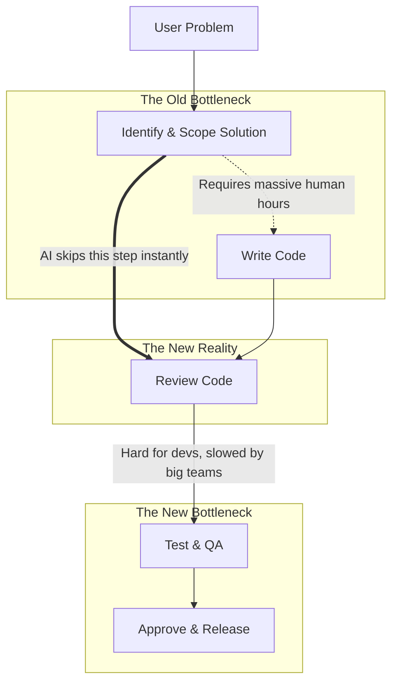

# The End of the "Lines of Code" Era: How AI is Fundamentally Changing Dev Teams

Theo argues that the long-running meme about AI replacing developers in six months is no longer a joke—it is happening right now. Between massive recent advancements in AI coding tools and stark market signals, the nature of building software has fundamentally transformed. He believes we have reached the end of an era where writing lines of code was the primary bottleneck in software engineering.

To contextualize how integrated these tools are in his own work, Theo highlights his reliance on AI code-review agents like Code Rabbit. Because his teams are generating code so rapidly, human review of massive pull requests is no longer feasible. AI agents are now catching complex issues he would otherwise miss, such as accidentally committing build directories in 3,000-line pull requests or identifying novel bugs in async cleanup operations. 

### Proof of the Shift: Building Better Alternatives in Weeks

To demonstrate how trivial coding has become, Theo shares his experience replicating highly funded products using AI tools without writing a single line of code himself.

*   Theo was frustrated with Frame.io, a video review platform acquired by Adobe for $1.3 billion, because it was heavily bug-ridden, slow, and had poor user experience.
*   Working part-time over just two weeks in the background of his daily responsibilities, he "vibe-coded" an alternative called Lawn by guiding an AI with structural descriptions and architectural prompts.
*   Despite being AI-generated, he insists the code is not "slop"—Lawn runs faster, loads instantly, and handles complex data loading and pre-warming patterns far more efficiently than Frame.io.
*   Similarly, for his project T3 Code, he and a single teammate out-paced OpenAI and Microsoft, alternating daily ownership of the main branch to ship code without the friction of large-team approvals. 

Theo concludes that ideas are now simultaneously more and less valuable. A novel idea can be executed rapidly, but cloning someone else’s multi-million dollar product is also now incredibly trivial. The protective moat built by simply having a large engineering team is gone. 

### Why Big Teams are Now a Liability

Theo uses the recent layoffs at Block to illustrate how market leaders are adapting to this shift. Jack Dorsey laid off roughly 4,000 employees despite the company being highly profitable and growing. Theo praises Dorsey's execution of this layoff, specifically noting the severance structure.

*   The provision of 20 weeks base pay gives all impacted employees a very comfortable five-month buffer to figure out their next steps.
*   Offering an additional week of severance per year of tenure properly rewards the long-term loyalty of veteran employees.
*   Vesting equity through the end of May ensures that workers do not arbitrarily lose out on impending, highly valuable stock grants.
*   Allowing employees to keep their corporate devices and giving them a $5,000 transition stipend is highly beneficial to lower-income or support staff whose company laptop might be their only computer.
*   Allowing departing employees to retain Slack and email access for days to say goodbye appropriately treats them like human beings, avoiding the cold, immediate lockouts common in the industry.

Theo agrees with Dorsey's rationale that smaller, flatter teams are now mandatory. In the past, massive systems like GitHub or Microsoft's Copilot required large teams because writing code was expensive and slow. Today, large teams act like aircraft carriers: they have too much inertia to change direction. Theo points out that getting Microsoft to update a simple one-line model toggle for Gemini 3.1 Pro currently takes massive bureaucratic effort, whereas a single developer with an AI agent could execute it instantly. 

### The Shifting Bottleneck in Software Engineering

Historically, the software development pipeline functioned as a funnel where ideas dropped off because writing the code was simply too expensive and time-consuming. Because AI has made lines of code effectively free, that bottleneck has moved. 

Because an entire feature can now be generated by pasting a user's complaint into an AI prompt, companies are generating hundreds of pull requests they cannot process. The new bottleneck is reviewing the code, thoroughly QA testing it, preventing regressions, and managing release rollbacks. 

More engineers actually exacerbate this new bottleneck. Every additional engineer is another person who must review, approve, and sign off on a merge, steepening the slope of the delivery funnel and stopping features from reaching the user. 

### The Future Role of Developers

Theo warns that many developers will hate the new reality of the industry. Writing code—which most developers view as the fun part of the job—is being heavily reduced. Instead, developers will spend their days dealing with the consequences of AI-generated code: reviewing, running QA, testing, and managing systems integration. 

Despite this, Theo believes this is an incredibly empowering time for developers if they are willing to adapt their mindset. He advises developers to do the following:

*   Stop relying purely on coding skills and start talking directly to users, designers, and product teams to deeply understand the product.
*   Take personal ownership of the release processes, safety nets, and alerting systems that allow rapidly generated code to ship safely. 
*   Embrace automating their own roles so they can take on a macro-level view of the application rather than getting lost in the syntax.

Ultimately, Theo concludes that while AI agents are incredible at outputting code, they completely lack agency. Agents do not have initiative, focus, or a sense of ownership. Developers who take ownership, understand their users deeply, and steer the AI effectively will thrive. However, developers who refuse to learn who their customers are, or expect to just sit quietly and type lines of code, will soon find that an agent knows more about their job than they do.
