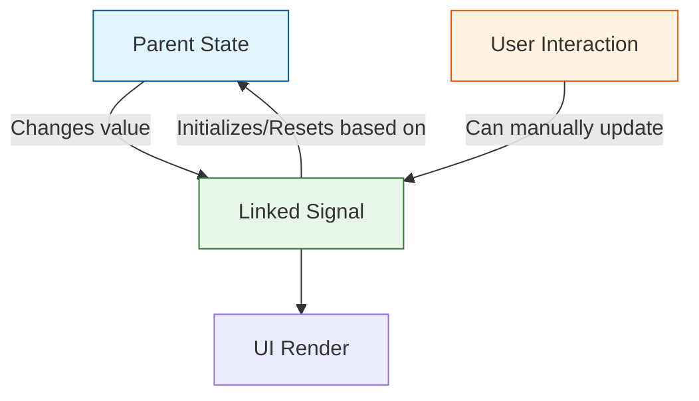

# Angular 19: Catching Up, Innovating, and Embracing the Modern Web

Theo is genuinely excited about the release of Angular 19. While historically critical of Angular's isolation from the broader frontend ecosystem, he believes this release proves the team is finally paying attention to modern frameworks like React, Next.js, and Solid, as well as the needs of their own developers. Before diving into the framework, he briefly highlights a tool called Stagehand by Browserbase, an open-source web browsing framework that allows developers to write automated browser tests using simple English prompts rather than complex selectors. 

### A Shift in Philosophy and the Convergence with Whiz

One of Theo's key takeaways is that Angular is actively working to shed its reputation for outdated developer experiences. He notes that Angular codebases from a decade ago have largely retained the same quality, which avoided the fragmentation seen in many older React codebases, but at the cost of falling behind modern standards. 

To catch up, Angular is merging underlying capabilities with Whiz, Google's highly performant, private internal framework used for massive applications like YouTube. Theo points out that while Whiz is incredibly fast, its developer experience has historically been poor. By combining Whiz's performance with Angular's developer tools, Google hopes to create a unified framework. Theo is rooting for this convergence to succeed, noting that large platforms like YouTube will likely be ported to this new architecture.

Theo also praises the Angular team's rollout strategy. Remembering the "Red Wedding" of the Angular.js to Angular 2 rewrite that alienated many developers, the team is heavily utilizing automated code-mods and language server tools. This allows developers to easily transition their older, class-based code to modern paradigms with a single click, ensuring the community is brought along safely rather than left behind.

### Major Features and Improvements

Theo highlights several major features that bring Angular's performance and developer experience in line with, and sometimes ahead of, its competitors:

*   **Incremental Hydration:** Currently in developer preview, this feature allows Angular to delay loading the JavaScript for a component until a user actually interacts with it. Theo praises this approach for dramatically reducing initial JavaScript loads, though he notes the team will need to balance lazy loading with background prefetching so the application does not feel sluggish upon first click. 
*   **Event Replay:** This feature, now enabled by default, fixes a common server-side rendering issue where user clicks are lost before the JavaScript has fully loaded. It records interactions and executes them once the corresponding JavaScript hydrates, an approach Theo firmly believes is the correct architectural choice, despite disagreements from Qwik creator Mishko Hevery. 
*   **Granular Route Level Configuration:** Angular now allows developers to explicitly configure whether a route should be client-rendered, server-rendered, or pre-rendered at build time. Theo heavily prefers this clean, configuration-based approach over the "magic variables" currently used in Next.js.
*   **HMR for Styles:** Hot Module Replacement for CSS is finally supported out of the box. Theo considers this a massive developer experience win, as developers can now save style changes in their editor and see them immediately in the browser without losing the state of the UI they are testing.
*   **Standalone Components as Default:** Angular is moving away from complex, encapsulated component bridging. Standalone components are now the enforced default, a change Theo notes is simply a validation that isolated components are fundamentally a better way to build web applications.
*   **Zoneless Angular:** The framework is taking steps to remove its reliance on Zone.js, a heavy dependency historically used to track when an application has finished rendering for server-side logic. 

### The Reactivity Overhaul: Signals

A massive part of Angular 19 is the stabilization and expansion of Signals, a reactivity model heavily inspired by frameworks like SolidJS. Angular provides automated commands to migrate old inputs, outputs, and view queries over to this new granular, signal-based system, immediately yielding performance improvements.

Theo is particularly impressed by the introduction of Linked Signals. In complex user interfaces, developers often need an interactive state that resets when a higher-level dependency changes. Linked Signals solve this natively. 

Theo illustrates this with an e-commerce example: if a user selects a specific item option (like "fig"), but the parent list of available options updates to no longer include "fig", standard state management breaks down and leaves ghost selections. Linked Signals allow the developer to create a derived value that the user can mutate, but that automatically re-evaluates and resets logically if the overarching options array changes. 

Finally, Theo notes the introduction of the experimental Resource API, which integrates asynchronous operations into the Signal graph. Observing these changes, Theo concludes that Angular is steadily shifting away from RxJS in favor of continuous, predictable signal flows, much like how React Hooks ultimately displaced Redux.
