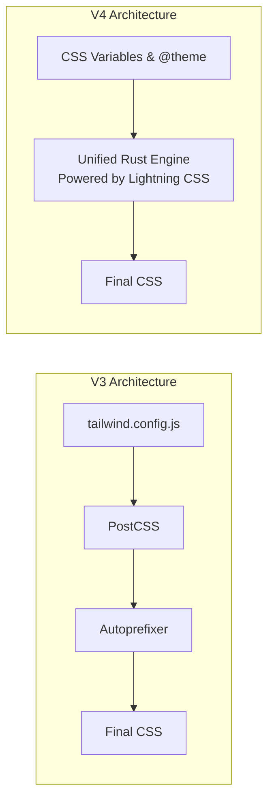

# Tailwind V4 Beta: Major Overhaul, Rust Engine, and CSS-First Config

Theo recently tested the newly released beta for Tailwind V4, marking what he considers the biggest overhaul of the framework to date. After eight months of development, the Tailwind team has completely rewritten the engine in Rust. Theo details how this fundamentally changes project configuration, dramatically improves build speeds, and introduces a massive suite of modern CSS features.

### Performance and Architecture Changes

When the Tailwind team says V4 is "built for performance," Theo clarifies that this refers strictly to developer build times, not client-side browser performance. Client-side, Tailwind is already highly optimized because it only ships a fixed, capped amount of reusable CSS that scales perfectly. 

The real performance leap in V4 comes from its new Rust-based architecture heavily utilizing Lightning CSS. Overall builds are up to five times faster, but incremental builds—which happen constantly as you add known classes during development—are up to a hundred times faster, completing in mere microseconds.

Tailwind V4 also consolidates the styling pipeline into a unified toolchain. Developers likely will no longer need to manually cobble together PostCSS and Autoprefixer, as import handling, vendor prefixing, and syntax transforms are built right into the framework.

Theo does note a nuance regarding the build pipeline depending on your framework. While tools like Vite can utilize the new setup flawlessly, frameworks tightly coupled to PostCSS (like current iterations of Next.js) may still experience slightly slower processing until they natively integrate Lightning CSS.

### The JavaScript and Prefixes Debate

While discussing performance, Theo addresses a common critique of Tailwind brought up by Nam, the creator of StyleX. Nam argues that the lack of uniform prefixes on Tailwind classes (like `flex` or `grid` instead of a standardized format like `tw-flex`) hurts client-side performance when using JavaScript utilities like `tailwind-merge`. 

If a React component has a default red background and accepts a prop for a purple background, the client-side JavaScript has to calculate which class overrides the other. Because Tailwind features so many unique, unprefixed shorthand words, the software has to run complex checks to find the differences. If all classes shared a standard prefix system, processing those overrides would be dramatically faster. Theo finds it interesting that instead of adding prefixes to alleviate this, Tailwind is doubling down and actually removing certain prefixes in V4.

### The Automated Upgrade Experience

Curious about how easily an existing project could transition, Theo runs the new `npx @tailwindcss/upgrade` command on his app Quickpi. He was highly impressed with the automated results and how the framework manages backward compatibility.

*   The upgrade command completely removes the old `tailwind.config.js` file, migrating all configuration directly into standard CSS files using directives like `@plugin` and `@theme`.
*   Rather than quietly hot-fixing changes across a codebase, the tool drops backward compatibility overrides into a central global CSS file (such as explicitly setting `border-color: currentcolor` on elements to preserve V3 behavior).
*   Theo explains that putting all legacy overrides in a single global file is brilliant for large codebases, as it acts as an exact, top-to-bottom checklist for technical debt that developers can slowly refactor over time.

### New Features and Syntax Updates

V4 introduces heavy support for modern web standards and relaxes rules on how classes scale. Theo highlights several key features that he believes will significantly improve the developer experience.

*   **Arbitrary value interpolation:** You can now write classes like `h-54` or `h-12.5` without using brackets, though Theo warns this could result in "cursed" sizing and clutter your codebase by bypassing Tailwind's standard, cohesive design system scales.
*   **Wider color gamut:** V4 implements OKLCH colors, which Theo celebrates as a necessary shift away from standard RGB to natively support modern HDR display environments.
*   **Reversed media queries:** A new `@min` and `@max` syntax allows developers to easily target when a class should turn off (e.g., `max-md:hidden`), which Theo finds much cleaner than chaining multiple overrides for desktop displays.
*   **Native 3D transforms:** Elements can now be manipulated in three dimensions directly via classes like `rotate-x-49` or `z-38`, which opens up complex hover animations previously requiring custom CSS.
*   **CSS field sizing:** Support for `field-sizing: content` lets input forms automatically expand to fit the text being typed inside them.
*   **Advanced variant targeting:** The introduction of the `not` variant, `starting-style` for clean popover entry animations, and descendant variants (`*`) allow for deep, composable control over how child elements interact with parent data states.
