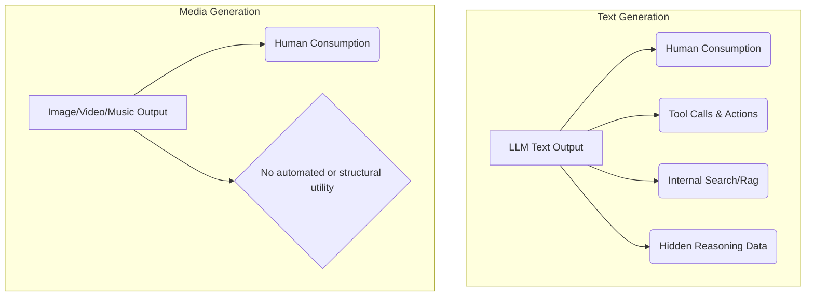

# Theo's Breakdown of PewDiePie's Unexpectedly Brilliant AI Takes

Theo recently broke down a video by the massive YouTube creator PewDiePie titled "Stop Using AI right now." To Theo's surprise, PewDiePie—who recently transitioned from gaming content to building hardware and experimenting with AI—delivered some of the most insightful and nuanced takes on the current state of artificial intelligence. Theo uses PewDiePie's video to dive deep into the hardware realities, the ethical implications of media generation, and the real pathway toward Artificial General Intelligence (AGI).

### The Brutal Hardware Realities of AI Computation

PewDiePie built an expensive rig using multiple modified RTX 4090 graphics cards, revealing the staggering costs of running AI locally. Theo uses this to explain the harsh realities of computing hardware, pointing out that VRAM (Video RAM), not processing speed, is the ultimate bottleneck for AI. 

To run a model efficiently, a GPU must hold all of the model's parameters in its memory. Putting more RAM into a GPU does not make it faster, but it raises the ceiling on what it can hold before the system is forced to pull from a vastly slower storage drive.

*   Theo notes that Nvidia's powerful enterprise A100 GPU costs around $20,000 primarily because it holds 80GB of VRAM, allowing it to fit massive models gracefully.
*   However, if you test a modern consumer card like the RTX 5090 (which has less VRAM but newer architecture) against the A100 using a model that fits on both, the 5090 is actually faster at processing. 
*   Theo argues the Apple Mac Studio is the underrated champion for local AI. With its "unified memory" architecture, a user can access up to 512GB of RAM that the GPU can utilize directly, making a $9,500 system highly practical for running huge models at reasonable speeds.
*   He completely dismisses the idea that consumer-grade local hardware will ever run models as smart as massive cloud models like GPT-5, noting that the enterprise hardware required for top-tier models currently costs hundreds of thousands, if not millions, of dollars for a single server array.

### Why AI Art and Media Generate Apathy

PewDiePie strongly criticizes AI-generated art and video for looking cheap, lacking soul, and relying on stolen artwork. Theo aggressively agrees but pushes the argument much further by contrasting the core utility of AI media generation against AI text generation. 

Theo asserts that a piece of art or media loses its emotional impact when you realize every detail was generated by an algorithm rather than intentionally chosen by a human. He argues that AI media generation aims to replace human creatives entirely, whereas AI coding assistants started out trying to augment developers.

To illustrate why he finds AI media "cringe" and functionally useless compared to text generation, Theo breaks down how their outputs are utilized:

*   The vast majority of text generated by LLMs is never actually read by humans. It is used as hidden reasoning data, context gathering, code execution, or tool calling to make software work.
*   Because text has high utility outside of human consumption, the massive enterprise investments into LLMs make fundamental sense.
*   Conversely, an AI-generated image or video has zero utility if a human is not looking at it. Its only practical use case is flooding the internet with "slop," stealing jobs, or creating cheap thumbnail assets. 

### Overcoming AI Fatigue and Grifter Culture

Both PewDiePie and Theo admit to feeling intense fatigue over the mere mention of AI. Theo notes that the space is overflowing with crypto-influencers who pivoted to AI to chase trends and corporations shoving useless AI features into products just to boost their stock valuation. 

Theo confesses he initially hesitated to enter the AI conversation because the prevailing discussions made absolutely no logical sense to him. After a month of deep research, he realized he wasn't the confused one; the influencers were simply uneducated. He highly praises the small, emerging community of true tech educators—like AI Code King, AI Explained, and Simon Willison—who focus on how the technology operates rather than hyping up a financial bubble.

### Learning to Code with AI

PewDiePie used small local models alongside tools like Aider to write code on his computer, noting it initially made him question the point of learning to program. Theo pushes back, explaining that typing speed is not what makes a developer successful; it is the ability to think through and understand complex systems. 

Theo outlines a strict personal rule for using AI as a learning tool:

*   Never let an AI agent write code or solve problems that currently exceed your own fundamental understanding of programming.
*   If you already understand how to build a basic component (like a web calculator), it is safe to let the AI draft it to save time so you can focus on harder logic.
*   If you do not grasp a concept, you should not ask the AI to build it for you; instead, you should ask the AI to act as a tutor and explain the concept thoroughly so you build your own direct knowledge.

### Tooling is the True Path to AGI

In a profound realization, PewDiePie noticed that a tiny, seemingly "dumb" 2-billion-parameter local model became incredibly useful once he connected it to web search and memory. Theo points out that this observation touches the absolute cutting edge of the software industry's current understanding of AI architecture.

Theo argues that Artificial General Intelligence (AGI) will not come from simply stuffing more parameters into an ever-expanding super-model. 

*   The future of AI lies in the harness—the set of tools the model is allowed to access to traverse codebases, execute programs, and search the web.
*   We need to stop thinking of the model as the vehicle itself, but rather as the driver. A brilliant model cannot go anywhere without a capable "car" (toolset) to drive it.
*   Models will eventually self-improve not by making their own fundamental "brains" smarter, but by writing code to build themselves better tools to interact with system environments. 

Theo concludes by expressing sheer amazement that a 20-minute video from a gaming YouTuber managed to successfully touch upon the entire modern AI ecosystem with such practical accuracy.
