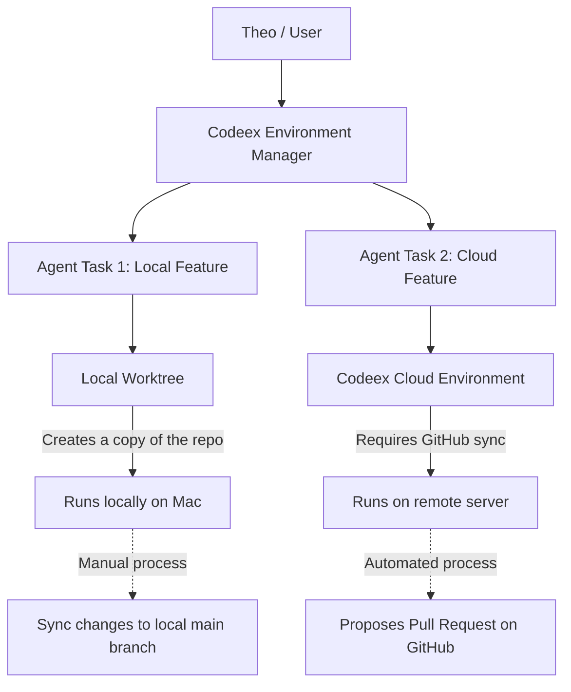

# The New OpenAI Codeex App: How It Changed Theo's Coding Workflow

Theo recently made a major shift in how he develops software, entirely dropping Cursor and drastically reducing his use of Claude Code. His new tool of choice is a recently released, free application from OpenAI called Codeex. While he acknowledges the name is confusing, he has found the product so fundamentally transformative that he bought a dedicated secondary laptop just to keep using it while under a non-disclosure agreement. 

Despite being heavily invested in competing tools and paying for his own model usage, Theo strongly endorses Codeex. He notes that while he uses Claude Code for general computing tasks like writing one-off scripts, web scraping, and terminal configurations, Codeex has become his exclusive environment for actual software building and scaffolding.

### What Codeex Is and How It Works

Codeex bridges the gap between a traditional command-line interface and a graphical manager. It functions as an orchestration layer for AI coding agents, allowing developers to manage multiple complex workflows across different projects simultaneously. 

*   **A Unified Interface for Agents:** The macOS application acts as a graphical front-end for the underlying Codeex CLI agent. It shares history and configurations natively, meaning work started in the terminal seamlessly carries over to the app.
*   **A Managerial Workflow:** Because the GPT-based models are thorough but slow to execute, Theo now feels more like a manager than a line-by-line coder. He assigns a heavy structural task to the agent in one project, and while it plans and writes code, he simply clicks over to a different project thread to review pull requests or start new tasks.
*   **Editor and Git Integration:** The app does not try to be a text editor. Instead, it features one-click buttons to open generated code in editors like VS Code. It also features a code diff panel, the ability to auto-generate commit messages, and a tool to instantly turn committed changes into a pull request.
*   **Skills and Integrations:** Codeex supports MCP servers and various integrations. Theo points out tools that allow the agent to deploy to Cloudflare, view the browser visually via Atlas, and update Linear issues based on codebase changes. He specifically highlights a skill called "Yeet," which automatically stages, commits, and creates a PR when the agent believes the work is done.
*   **Automations:** Users can set up cron-like scheduled tasks driven by AI prompts. Theo demonstrates setting up an automation that runs every day at 9:00 AM to scan all commits made in the last 48 hours across multiple repositories, actively looking for bugs and automatically generating a thread with its findings.

### Solving Parallel Work within a Single Project

One of Theo's favorite capabilities of Codeex is how it handles running multiple agent tasks inside the exact same repository without causing file conflicts. He achieves this by splitting agent runs across local worktrees and configured cloud environments.

*   **Local Worktrees:** Git normally makes it difficult to work on multiple branches simultaneously. Codeex bypasses this by copying the project directory to a new location on the machine for the agent to work in. Theo notes that while this is the most thought-out worktree implementation he has seen, syncing the code back to the primary local branch can still feel clunky.
*   **Cloud Environments:** To avoid local worktree friction entirely, Theo often points the Codeex app to a synced GitHub cloud environment. This allows him to kick off a heavy feature build on a remote server that will eventually generate a pull request, while he continues working locally in the main repository. He does mention, however, that configuring cloud environment variables remains a frustrating, unsolved problem.

### Tooling Performance and the Future of IDEs

Early on during his testing, Codeex suffered from severe memory leaks and battery drain. Theo loved the workflow so much that instead of giving up, he actually built his own native macOS alternative entirely in Swift and AppKit just to preserve his battery life. Fortunately, the Codeex team was highly responsive, fixing the performance issues rapidly and rendering his side project unnecessary.

To complement his faster coding workflow, Theo also mentions using Blacksmith for his continuous integration. By changing a single line in his GitHub Actions setup, Blacksmith reduced his Rust compile times from over three minutes down to roughly 45 seconds, providing a dashboard that makes debugging CI failures incredibly simple.

Ultimately, Theo concludes that terminal-based agent user interfaces will likely be a short-lived phase. He predicts most developers will return to graphical interfaces, but not traditional IDEs. Because Codeex orchestrates agents so effectively, Theo admits it has entirely killed his interest in opening standard code editors to manually edit code or read it line-by-line. Instead, he views code generated by the agent, ensures he understands the "why" behind what the agent is doing, and merges the results.
