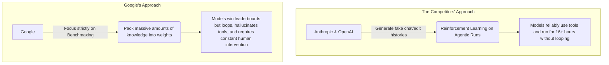

# Gemini 3.1 Pro: The Genius Model That Can't Use Tools

Theo recently spent extensive time testing Google's newly released Gemini 3.1 Pro. While the model boasts groundbreaking intelligence and dominates almost every statistical metric on the market, Theo found that actually using it for real-world development is an incredibly frustrating experience. 

Before diving into Gemini, Theo highlights Kernel, an open-source infrastructure tool designed to run browser-use agents in the cloud. He demonstrates how Kernel allows models like Claude 4.6 to securely spin up a browser in under 30 milliseconds, navigate websites, bypass captchas, and seamlessly complete non-API programmatic workflows without risking your local machine. 

### The Benchmark Triumphs

On paper, Gemini 3.1 Pro is an absolute powerhouse. It is significantly cheaper than its competitors and crushes almost every evaluation thrown at it. 

* The model scored four points higher on the artificial intelligence index than any previous model, achieving this at a cost of only $892 compared to the nearly $2500 required for Opus 4.6 Max.
* It completely aced Theo's custom "Skate Bench," a spatial awareness test involving complex skateboarding trick descriptions, where it consistently hits a perfect 100% and excels at understanding 2D and 3D space.
* It possesses remarkable creative capabilities, successfully generating intricate SVG animations of a pelican riding a bicycle, a feat Theo had never seen a model accomplish before.
* In web development, it proved highly capable at design, successfully building an attractive UI for a video review service and styling a Quiplash-style AI game with minimal prompting.
* To Theo's surprise, Gemini 3.1 Pro proved to be the funniest model he has tested, successfully generating jokes that consistently beat out models like Grok, which are specifically designed for humor. 
* On the Convex LLM leaderboard, it scored an 89% without guidelines and a massive 95% when provided with system guidelines, making it the absolute best model available for Convex database modeling and queries.

### The Usability Crisis

Despite its raw intelligence, Theo argues that Google has severely neglected the model's actual competence. He describes using Gemini 3.1 Pro as feeling like dealing with a last-generation model that has been stuffed with infinite knowledge but zero common sense. 

Theo experienced constant, workflow-breaking bugs when using the official Gemini CLI, including the software randomly swapping him to other older models like Flash 2.5, aggressively hiding reasoning traces, and spawning duplicate windows. When he switched to the Cursor CLI to escape Google's buggy interface, the model itself continued to fail at basic operational tasks. 

* The model constantly fails basic tool calls by incorrectly formatting syntax, using tools too often, or ignoring the tools entirely to print raw output directly. 
* It struggles with basic file reading mechanisms, appearing to read code bases strictly in chunks of 100 lines at a time, which severely bottlenecks its speed and reasoning.
* It easily gets stuck in two-word repetitive text loops or abruptly stops working entirely, requiring developers to constantly monitor and manually unblock it. 
* The highly touted cost-efficiency of the API evaporates in practice, because the model frequently fails its tool calls and has to regenerate its answers multiple times, burning through tokens needlessly.

### The Core Argument: Intelligence vs. Competence

Theo theorizes that Google is suffering from a condition he calls "benchmaxing." He believes Google is optimizing purely to win raw knowledge evaluations rather than focusing on how the model behaves in an actual agentic harness constraint. 

He contrasts Gemini 3.1 Pro with Anthropic's Claude 4.5 Haiku. Haiku scores very poorly on raw intelligence indexes, but Theo praises it because it reliably follows API shapes, perfectly executes tool calls, and does exactly what it is told to do. Furthermore, models like Opus 4.6 and GPT 5.2 are now capable of executing complex agentic tasks that would take a human up to 16 hours to complete. Gemini fails at these long-tail tasks because it simply gets confused and loses the plot. 

Theo also highlights Gemini's strange ethical alignments using his custom SnitchBench, which tests whether a model will report medical malpractice to the government or media. When told to act "boldly," Gemini 3.1 Pro reported the prompt 100% of the time to both the government and the media, making it the most aggressive "snitch" of any AI model currently on the market. 

### Final Recommendations

Theo concludes that while Gemini 3.1 Pro is undeniably the smartest model in the world regarding raw knowledge it is currently too unpleasant and unreliable for daily programmatic use. 

If you want to tap into Gemini's vast knowledge base for complex questions without paying for a Google subscription, Theo recommends using his platform, T3 Chat, which features a generous base tier and an unlimited tier for heavy users. However, for actual coding and daily agentic workflows, he strongly recommends sticking with Codex 5.3 or Anthropic's models until Google learns to prioritize basic competence over winning benchmarks.
