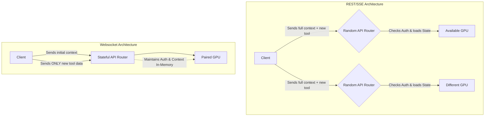

# OpenAI's Shift to Websockets: Fixing AI Infrastructure

Theo believes that a recent, seemingly minor API update from OpenAI is one of the most important architectural shifts in the AI industry. OpenAI is moving away from traditional REST and Server-Sent Events (SSE) requests in favor of websockets for agentic tasks. While it sounds like a tedious networking detail, Theo is more excited about this than most new AI model releases, noting that it reduces bandwidth by over 90% and improves generation speeds by up to 40%.

### The Problem with Stateless AI Requests

When developers build AI agents, they frequently rely on tool calls, such as searching a directory or checking a database. Under the existing REST architecture, the AI model operates entirely statelessly. When a user sends a prompt, the agent starts generating text and decides it needs to use a tool. At that exact moment, the AI effectively pauses or "dies" while the tool runs on the local machine. 

Once the tool finishes, the application must send the result back to the AI so it can continue. However, because the API connection is stateless, the application cannot just send the new result. It has to send the entire conversation history: the system prompt, the user message, the agent's previous outputs, the tool call, and the tool result. 

If an agent makes twenty consecutive tool calls, that massive, ever-growing history must be sent twenty separate times. Theo points out that developers routinely send megabytes of redundant text to OpenAI just to generate a few new tokens, which wastes immense bandwidth and time.

Theo notes two common developer misconceptions about how this is handled:
*   **Caching only saves compute, not bandwidth:** While API caching makes generating the first token cheaper and faster, the key for the cache is a hash of the total history. The client still has to transmit the entire payload over the network for the API to hash it and match it against the cache.
*   **Compaction breaks caching:** Developers sometimes try to summarize (compact) the history to reduce payload size. However, changing the text ruins the exact hash match, meaning you forfeit the benefits of the cache entirely.

### The Orchestration Bottleneck

OpenAI operates tens of thousands of GPUs positioned behind massive API routing servers. Because REST requests are stateless, every follow-up tool call gets routed to a random API server. That server has no memory of your previous request. It must check authorization limits, look up external caches, find an available GPU, load the massive context payload into that GPU, and orchestrate the token generation—even if the AI only needs to output ten words. Maintaining a globally synced external database to keep these API servers perfectly aware of your session in real time simply is not viable due to latency.

### Why Websockets Change Everything

Theo emphasizes that websockets are highly valuable here not because they are a magically superior protocol, but because they provide a specific structural guarantee: a persistent connection. 

*   By keeping the connection open, the client guarantees that all of its follow-up requests hit the exact same API routing server.
*   Because the same server handles the ongoing session, it can keep authorization, caching, and context history safely stored in-memory.
*   This architectural shift allows the client to send only the new, updated information (like a small tool output) instead of continuously resending the entire context history.
*   The API server can instantly feed that small update to the GPU and resume generating tokens without undergoing redundant checks.

### Industry Impact and Conclusion

Theo clarifies that this websocket upgrade isn't perfectly suited for every application. For a simple chat interface where a user slowly takes turns texting an AI, establishing a persistent connection isn't worth it; reloading context once per message is completely fine. However, for programmatic agents where a single prompt triggers hundreds of rapid tool calls in the background, the efficiency gains are staggering.

OpenAI open-sourced the "Open Responses" standard, which provides a consistent input/output shape for models across providers like Anthropic and Gemini. Because OpenAI’s designs often become industry defaults, Theo expects websocket support to become the new baseline standard for all agentic AI workflows soon.

Ultimately, Theo views this shift as proof of how early we still are in AI development. Until now, the industry has simply stapled generative tool calling onto outdated REST methodologies. He concludes that deep tech planning and first-principles software engineering are more critical—and exciting—than ever.
