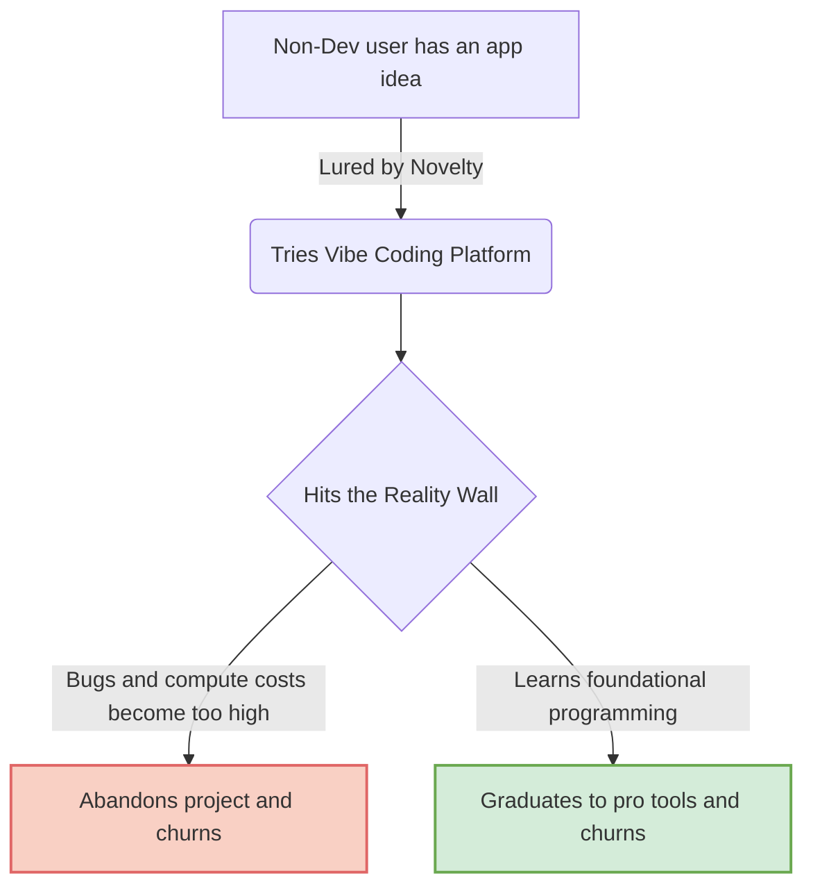

# The Reality of Vibe Coding: Aspirations, Novelty, and the GoPro Effect

Theo tackles the recent discourse surrounding "vibe coding" and whether the massive hype around AI application builders is coming to an end. To set the stage, he defines vibe coding strictly as web-based platforms, like Lovable, Bolt, and v0, designed specifically for non-developers. These are tools meant for everyday people who do not know how to read or write code, allowing them to try and build small applications from scratch.

As a transparent disclosure, Theo notes that he is an early investor in both Lovable and Bolt, as well as the professional AI code editor Cursor, though he approaches the topic highly critically.

### Analyzing the Perceived Decline

The conversation stems from a viral post claiming that traffic for tools like Lovable dropped by nearly 50% over a few months, suggesting the vibe coding trend is dying. The post argued that the viral wave had passed, users were burning through compute budgets, tighter monetization pushed casual users away, and AI coding was simply being absorbed into standard developer environments. 

Theo pushes back on the framing of these arguments. He argues that the critique is deeply "Tech Twitter-brained" and fundamentally misunderstands the target audience, which consists of complete beginners, not professional peers. Furthermore, he includes a real-time correction based on internal investor data: while raw web traffic did see a massive dip, this was largely the aftermath of a heavy advertising campaign that brought in a surge of low-intent users. According to internal metrics, Lovable's actual revenue and paying customer base are consistently growing, not dying. 

However, Theo still believes there is a structural problem with the vibe coding industry, which comes down to why people adopt these tools in the first place.

### Utility vs. Novelty

Theo explains that people generally try new tools for two distinct reasons: utility and novelty. A tool like React is chosen for utility because it is the industry default that solves real, boring problems. Tools like Svelte, or early AI code generators, are often chosen for novelty. They provide a rush because they make the user feel smarter, more capable, and excited about trying something different. 

This novelty is what drove millions of non-developers to vibe coding platforms. Everybody has an app idea, and these platforms offered an intoxicating promise that anyone could build their idea instantly. 

### The GoPro Effect and the Graduation Problem

To explain the business risk of vibe coding, Theo compares platforms like Lovable and Replit to GoPro. 

GoPro did not just sell a camera; they sold the aspiration of being an extreme sports filmmaker. Millions of people bought GoPros, filmed vast amounts of footage that went entirely unwatched, and eventually left the cameras to rot in their closets once they realized editing a good video requires substantial skill and effort. GoPro's stock valuation eventually crashed because they sold a promise to an "aspiring" market that never converted into a professional one.

Theo fears that vibe coding platforms are the GoPros of the software world. They sell the aspiration of being an app creator to the general public.

*   When complete beginners realize that deploying and debugging a real application requires much more foundational knowledge than just generating code, they become frustrated by the cost and difficulty and abandon the platform.
*   Conversely, if a user successfully pushes through the difficulty to learn how the code actually works, they outgrow the vibe coding platform entirely and switch to professional developer tools like Cursor.
*   Building a business that targets an "aspiring" demographic is historically dangerous, an expensive lesson Theo learned firsthand while building his previous livestream collaboration startup, Ping.

### The Silver Lining for the Industry

Despite comparing the business model to the doomed trajectory of GoPro, Theo remains highly optimistic about the cultural and educational impact of vibe coding. 

He notes that while the vast majority of people will abandon these platforms once the novelty wears off, a small percentage will experience an incredible "Aha!" moment. Just as owning a GoPro inspired a young Theo to get into video editing and eventually build a career on YouTube, vibe coding removes the massive friction of setting up a traditional development environment for absolute beginners. 

Even if platforms are heavily subsidizing compute costs for users who will eventually leave, they are artificially lowering the barrier to entry for programming. Much like Flash and Roblox ushered in massive waves of young game developers, Theo believes vibe coding will act as the ultimate gateway for the next generation of software engineers.
