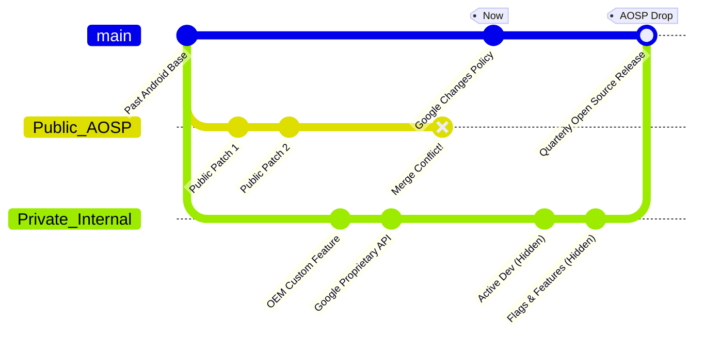

# The End of the Open Source Android Era

Theo largely attributes his start in software engineering to Android. When he was younger, the operating system felt magical because it was entirely open source. Much like inspecting HTML in a web browser, he could look at the code powering his phone, change it, and see how the world worked under the hood. However, Google is now fundamentally changing how they build Android, moving all active development out of the public eye and into private internal branches. 

To understand why Google is locking down the development of what was once the ultimate open platform, Theo explains the messy, reactive history of the operating system.

### The Surprising History of Android

Back in 2007, the mobile landscape was highly fragmented. Phones had physical keyboards and ran on entirely different operating systems. The industry standard for building mobile software was Java, which promised that developers could write an app once and run it anywhere. However, actually distributing those apps across separate manufacturer storefronts (like BlackBerry, Nokia, and Sidekick) was nearly impossible. 

The original Android project was not actually built to be an operating system. It was designed by a group of MIT students as an app store and a Java runtime layer. The goal was to install Android onto any phone, allowing developers to write their Java app once, put it on the Android store, and sell it to users regardless of their device hardware.

Then the iPhone launched. Apple introduced capacitive touch screens that allowed for multi-touch finger tracking, eliminating the need for styluses and physical keyboards. Google panicked. Realizing their original plan was obsolete, Google acquired the Android project and forced it to become a full operating system meant to directly compete with the iPhone. 

Because Android was originally built as a runtime layer, Google chose to write the operating system in Java. Theo believes this was a questionable decision that required Google to fundamentally rewrite the Java standard to make the OS performant. While Theo generally dislikes Oracle, he takes the controversial stance that Oracle actually had a valid point in their massive lawsuit against Google, as Google effectively copied and rearchitected Oracle's patented work for free to make Android function.

### The Slow Decline of Open Source Android

To get the operating system onto as many devices as possible, Google committed to keeping Android open source. This led to massive success, spearheaded by early phones like the T-Mobile G1 and the Verizon Motorola Droid. However, this openness resulted in severe fragmentation. Because manufacturers heavily customized their forks of the software, Android users would often stop getting updates after just six to eight months, while iPhone users received support for years.

To fix the update problem, Google began a long process of pulling the operating system apart, slowly eroding its open-source nature:
*   **Extracting core features:** Google ripped essential applications like the Play Store, messaging, and notification services out of the core OS and placed them into a closed-source bundle called Google Play Services. This allowed Google to update features without waiting on phone carriers, but it meant a purely open-source Android phone could no longer run most modern apps.
*   **Hoarding hardware innovations:** Google transitioned from creating pure, developer-focused Nexus devices to the consumer-facing Pixel line. To compete with Apple, Google kept vital software—such as image processing, camera applications, and AI integrations—fully proprietary, removing them from the Android Open Source Project (AOSP).
*   **Developing proprietary silicon:** Because chip manufacturers like Qualcomm held a monopoly and refused to innovate aggressively, budget Android phones stagnated in performance for years. Google eventually created their own proprietary, highly secretive Tensor chips to compete with Apple Silicon, further locking down the hardware layer.
*   **Restricting native APIs:** Today, completely open-source community forks of Android, such as GrapheneOS, are blocked from using native features like tap-to-pay. Google restricts these APIs under the guise of security, though Theo believes this points to fundamental insecurities in the platform's architecture.

### The Shift to Private Development

For years, Google maintained two separate development paths for Android. They had a public AOSP branch and an internal private branch accessible only to companies that paid for a Google Mobile Services license. 

Because manufacturers were building features on different timelines, syncing the public and private branches resulted in massive merge conflicts. To streamline this process, Google is abandoning public active development.

Google will still release the source code to the public via quarterly platform drops to comply with open-source licensing. However, the day-to-day development—the commits, the feature flags, and the ongoing patches—will happen entirely behind closed doors. Developers can no longer read the GitHub commit logs to see what Google is cooking up, effectively killing the ability for the community to peek ahead and prepare for future updates.

### The Epic Games Lawsuit Factor

Theo believes this lockdown is heavily motivated by Google's recent courtroom loss to Epic Games. For years, Google took a 30% cut of all digital app store transactions. To protect this revenue, Google secretly paid massive checks to phone manufacturers like Samsung to ensure the Google Play Store was bundled on every device, while explicitly paying them *not* to include competing app stores.

The courts recently ruled that this behavior constituted an illegal monopoly. Consequently, Google is now legally forced to allow competing app stores onto the Play Store and must stop paying manufacturers to block competitors. 

Because Google can no longer guarantee their dominance through financial contracts, Theo argues that moving Android development fully in-house is a defensive strategy. Google wants to mask their competitive advantages and limit the insight third parties have into the operating system.

### Theo's Takeaways

Theo is deeply saddened by this shift. For current app developers, very little will change, but for the culture of technology, it marks the end of an era. 

He worries about the future of software accessibility for the next generation. The magic of early computing, whether examining Android's source code or right-clicking to "Inspect Element" on a webpage, was that users could easily peek behind the curtain to learn how things were built. As computers give way to mobile apps, and open platforms slowly transform into closed, proprietary black boxes, the screen only goes in one direction. Kids today are losing the ability to tinker, modify, and explore the code that runs their world.
