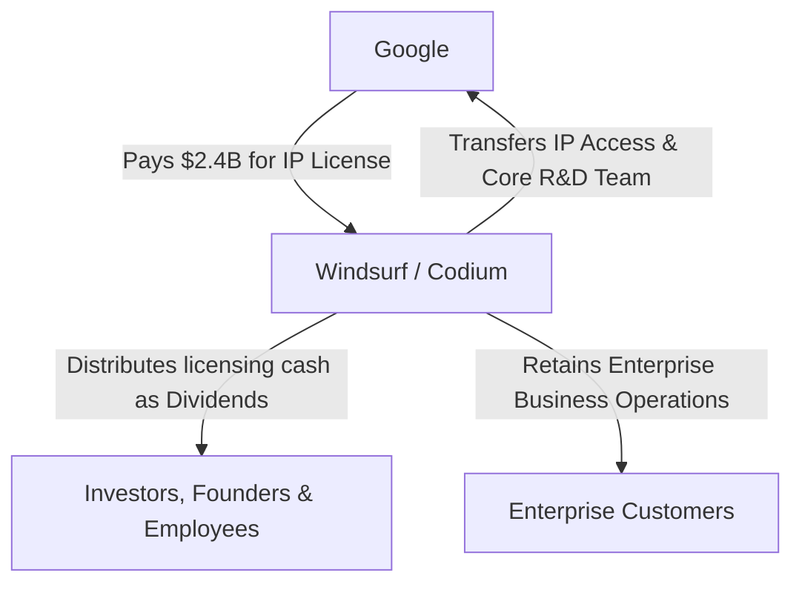

# The Chaos Behind the Windsurf, OpenAI, and Google Deal

Theo breaks down the chaotic and highly unusual transaction between Windsurf, OpenAI, and Google. After waiting months for updates on OpenAI's rumored three-billion-dollar acquisition of the AI code editor Windsurf, the market was stunned to learn that Windsurf's core team instead joined Google. Theo explains the complex business mechanics, investment strategies, and corporate rivalries that led to this bizarre outcome.

### The New Era of AI Poaching Backed by Billions
To understand what happened with Windsurf, Theo points to a recent trend where massively wealthy tech companies bypass traditional acquisitions to simply poach talent. He uses Meta's recent dealings with Scale AI as a primary example. 

Meta invested roughly fourteen billion dollars to secure a 49 percent stake in Scale AI. More importantly, this deal allowed Meta to recruit Scale AI's founder to lead their own super-intelligence lab while remaining a minority shareholder of the original company. This setup allowed early Scale AI employees and investors to cash out their otherwise illiquid private shares through secondary sales. Theo explains that big tech companies are willing to spend astronomical sums to poach top AI talent—often offering hundreds of millions to individuals—because advanced AI research and scaling data systems require niche experience that cannot be learned overnight.

### Why the Expected OpenAI Acquisition Failed
Windsurf's founders, employees, and investors were heavily anticipating the three-billion-dollar acquisition by OpenAI. However, the deal collapsed due to a pre-existing legal complication between OpenAI and Microsoft.

*   Microsoft has an agreement with OpenAI that grants Microsoft the rights to any intellectual property developed by OpenAI until Artificial General Intelligence is achieved.
*   Because Windsurf is built as a fork of Microsoft's own VS Code, acquiring Windsurf meant any novel intellectual property the Windsurf team developed would immediately and automatically be accessible to Microsoft.
*   Theo argues this essentially made the acquisition valueless for OpenAI, as they would be spending billions to build a developer tool only to hand the competitive advantages directly over to Microsoft for free.

When this deal fell through, Windsurf's founder and CEO, Varun, was left in a difficult position. He had likely already mentally checked out of the startup grind, anticipating a massive payday and a comfortable leadership role at a larger, well-funded company. 

### Why Google Stepped In
With OpenAI out of the running, Anthropic uninterested, and Microsoft already dominating with VS Code and GitHub Copilot, Google emerged as the obvious buyer. Theo explains that winning over developers is the primary battlefield for AI companies right now.

*   Both Google and OpenAI are currently losing the developer tool war to Anthropic, whose Claude models are heavily favored by developers due to their unmatched reliability in tool calling and function execution.
*   Anthropic generates massive revenue precisely because independent developers and tools like Cursor rely heavily on their infrastructure, meaning developers dictate which AI models actually see real-world usage.
*   Google desperately needs to win developers back to its ecosystem, making Windsurf's intellectual property and its team highly valuable to them.

### The Clever Structure of the Google Deal
Instead of buying Windsurf outright, Google executed a highly unothodox licensing agreement. Theo explains that Google did not want to pay the full three-billion-dollar price tag, nor did they want to draw the attention of antitrust regulators by acquiring a prominent startup. Furthermore, if Google simply hired the Windsurf founder away with a massive signing bonus, the founder would be violating his legal fiduciary duty to his investors by abandoning the company and driving its valuation to zero.

To solve this, Google paid 2.4 billion dollars for a non-exclusive license to Windsurf's technology, alongside hiring the CEO and the core R&D team. 

Because the 2.4 billion dollars came in as revenue for a software license, Windsurf as a company now possesses a massive sum of cash. Theo reasons that Windsurf will use this cash to pay out massive dividends to its investors, founders, and employees. This effectively compensates the shareholders for the fact that the company's long-term valuation dropped significantly once the founding team departed. It allows anyone who wanted to exit to get their anticipated payout, avoiding lawsuits and fulfilling the CEO's fiduciary duty.

### The Future of Windsurf and Developer Tools
Following the Google deal, the remains of Windsurf have pivoted back to their original brand name, Codium, under the leadership of a new interim CEO.

Theo notes that the AI coding market is currently split into two distinct extremes, which Windsurf had been struggling to balance. On one end are beginners and "vibe coders" who want tools that practically write applications for them. On the other end are strict enterprise developers maintaining massive, complex legacy codebases in environments like Java and JetBrains. 

*   Google took the consumer and independent developer side of the business, walking away with the team and IP necessary to build the next generation of Google-backed coding tools to fight Cursor.
*   Codium retained the highly profitable, slower-moving enterprise business sector, which Google had no interest in entering or competing within anyway.
*   Theo concludes that the Windsurf IDE as it exists today will likely be sunset in favor of whatever Google builds next, while Codium will likely survive and achieve profitability maintaining AI tools for strict enterprise workloads.
