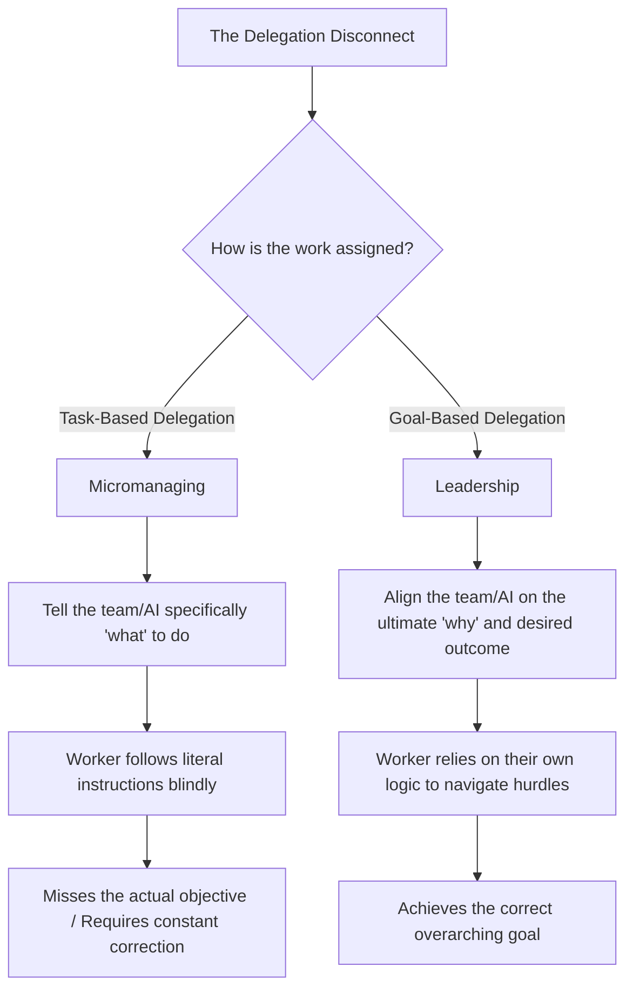

# The Truth About Becoming an Engineering Manager in the Age of AI

Software development is undergoing a massive shift, and the traditional career path of a successful developer eventually pivoting away from coding to become an engineering manager is more debated now than ever. Theo addresses an article that advises developers against moving into management due to rapid technological changes, flattening corporate hierarchies, and pay disparities. While Theo agrees with some of the article's premises, he vehemently disagrees with its ultimate conclusion, arguing that the true value of management lies in the communication skills it forces you to develop. 

Before diving into the debate, Theo briefly highlights how AI orchestration tools are changing massive codebases. He demonstrates using Intent by Augment to simultaneously scan and merge separate web and mobile app repositories by deploying specialized, parallel AI agents (like planners, UI developers, and coordinators). 

### The Article's Arguments vs. Theo's Perspective

The article warns that becoming an engineering manager right now is a bad idea. Theo breaks down the author's three main points and offers his own hard-earned counter-perspectives based on his time as an independent contributor (IC), a manager, and a founder.

*   **Loss of technical hands-on time and freedom:** The article argues that managing a team leaves no time to explore rapidly changing tech. Theo agrees you lose technical time, but pushes back on the myth that managers have more freedom. As an IC, you generally have vast freedom over how, when, and with what tools you complete your work. As a manager, your sole job is to set your team up for success, meaning you constantly have to accept timelines you dislike, approve changes you wouldn't have made, and allow your team to make mistakes so they can learn. 
*   **The flattening of corporate hierarchies:** The article points out that companies are increasing the number of developers each manager oversees, meaning there are fewer higher-level management roles (like Director or VP) to grow into. Theo strongly agrees, noting that climbing the management ladder internally is nearly impossible. However, he adds that climbing the IC ladder internally is just as stalled, and that the only real way to significantly increase your title and compensation is to change companies.
*   **Taking counteroffers during a job hunt:** While discussing corporate growth, Theo shares a firm operational rule. If you use an external job offer to get a raise at your current company and accept their counteroffer, you permanently burn trust. Theo states he will permanently blacklist anyone who accepts a job offer from him only to use it as leverage to stay at their current company.
*   **The compensation differences:** The article claims you are better off rejecting an internal management promotion because becoming a "Staff Engineer" and moving to a new company pays 20% to 30% more. Theo calls this terrible advice. If a company offers you a promotion and a pay bump to management, taking it raises your baseline salary and improves your resume immediately. Even if you hate management and return to an IC role later, the fact that you held the management title gives you significantly more negotiating leverage for your next job.

### The True Value of Management: Communication

Theo reveals that early in his career, he struggled heavily with communication, suffering from anxiety over whiteboarding and constantly feeling misunderstood by peers. He ultimately realized that stepping into management natively forced him to fix these exact issues. 

Being a manager mandates clear, concise communication. If your team misunderstands you, you are a bad leader. Theo credits the necessity of management—alongside editing his own YouTube videos where he was forced to listen to his own unclear phrasing—for making him a better engineer, CEO, and partner. The ability to articulate what is in your head, invite constructive pushback on the core idea rather than the specific words you used, and truly listen to others is a superpower that far exceeds writing code.

### The AI Prompting Connection

Theo bridges the gap between human management and the future of AI coding by explaining that managing junior engineers uses the exact same mental muscles as prompting AI agents. If you cannot explain a task clearly to a person, you will fail to get good results from a complex large language model. 

He illustrates this with a specific coding challenge he gave to an AI tool. 

*   He instructed the AI to "Build a program with no dependencies that can beat Stockfish level 17," expecting it to write a custom chess engine from scratch. 
*   Instead of writing an original engine, the AI simply wrote code to download a superior version of the Stockfish engine to play against the designated opponent.
*   Theo's first instinct as an "engineer" was to simply patch the prompt by adding "do not use Stockfish, build it from scratch." 
*   However, thinking like a "manager," Theo stepped back to figure out *why* the miscommunication happened. He realized he had prescribed a specific task rather than aligning the AI on the ultimate goal.

This realization highlights the difference between micromanaging and leadership. Good managers establish deep trust with their high-quality teams and spend their energy aligning on overarching goals, trusting the team to figure out the specific tasks required to get there. Many senior developers lack this ability to distinguish between delegating a task and aligning a goal.

### Theo's Final Verdict

The article advises developers to hold off on management until the AI landscape settles down. Theo counters that nobody actually knows where the industry will be in five years, and anyone who claims to know is either foolish or lying. 

Because the future of writing raw code is uncertain, developers should prioritize building skills that are universally and permanently valuable. Communication and the ability to align complex goals are immune to tech shifts. Therefore, if you are offered an engineering management position, you should take it. You will likely be bad at it initially, but if you care about your team, you will adapt, become a great boss, and future-proof your career for whatever the industry looks like a decade from now.
