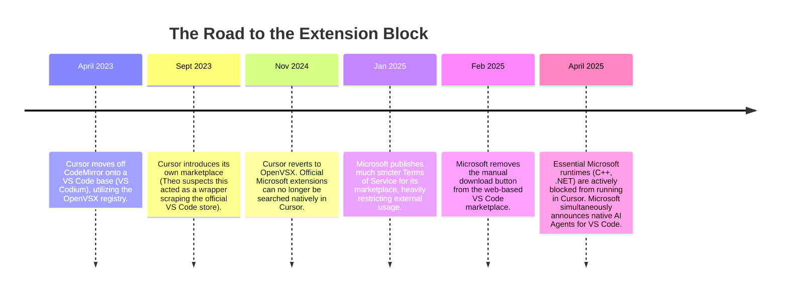

# The VS Code Extension Controversy: Why Microsoft Blocked Cursor

Theo, who is an investor in both Microsoft and Cursor, addresses a recent software controversy where popular Microsoft-owned VS Code extensions stopped working in external, AI-focused editor forks like Cursor and Windsurf. While many developers view this as a coordinated corporate attack by Microsoft to crush its AI competition, Theo argues the reality is much more nuanced and grounded in standard software maintenance. 

### The Evolution of the Extensible Editor
To understand the current conflict, Theo traces the history of how modern developers write code. The revolution started with Sublime Text, which proved developers wanted a minimal, lightning-fast editor with a community-driven extension marketplace. However, Sublime was closed-source and treated extensibility as a secondary feature. 

GitHub responded by creating Atom, utilizing web technologies to release a truly open-source, cross-platform editor. To do this, they invented Electron. While Atom was highly accessible, it suffered from severe performance issues and bloat. 

Microsoft, recognizing the shift away from standard, heavy IDEs like Visual Studio, adopted Atom's playbook to build Visual Studio Code. Driven by an elite engineering team and the massive success of TypeScript, VS Code vastly out-performed Atom and ultimately won the market. Theo notes that Cursor is essentially executing this exact strategy today. Just as VS Code piggybacked off the foundational work of Electron and Atom, Cursor is using open-source VS Code as a launchpad to innovate entirely new AI-driven ways of writing code.

### The Extension Breakdown

The core of the recent controversy stems from how these editor forks access VS Code's extension ecosystem. Theo breaks down a series of recent events that led to the current breakage:

*   Cursor initially used OpenVSX (an open-source extension registry) but eventually transitioned to a proprietary marketplace, which Theo suspects was a wrapper that quietly scraped Microsoft's official VS Code extension store.
*   In early 2025, Microsoft updated its official Terms of Service, explicitly forbidding the use of its proprietary extensions outside of approved, in-scope Microsoft products.
*   Microsoft subsequently removed the manual "download extension" button from the web marketplace, which destroyed a primary workaround Cursor users relied on to drag-and-drop unlisted tools into their editor.
*   Certain language tools, notably the C++ and .NET extensions, possess confusing licensing where the public wrapper may be open-source, but the underlying binaries and runtimes are strictly proprietary to Microsoft.
*   Shortly after these runtime restrictions hit external forks, Microsoft launched its own native AI agent mode and MCP integrations for VS Code, creating the public appearance of a synchronized strike against AI competitors.

### Theo's Perspective on Microsoft's Intentions
Despite the clear timeline, Theo rejects the popular conspiracy theory that Microsoft orchestrated a master plan to destroy Cursor. He suggests that Microsoft is simply too massive and decentralized for these distinct actions to be part of a unified, malicious strategy. 

Instead, Theo attributes the friction to isolated teams solving their own technical problems. A Microsoft developer publicly confirmed that the manual download button was removed due to technical struggles with delivering pre-release extension versions, not as a tactic to block Cursor. Furthermore, Theo believes the specific teams maintaining the C++ and .NET extensions were likely becoming overwhelmed with support tickets generated by outdated, third-party forks breaking their proprietary runtimes. Drawing on his own experience having to block the Brave browser from his video platform just to manage false bug reports, he argues the Microsoft teams simply disabled access for unsupported editors to reduce their massive support burden. 

Finally, regarding Microsoft's new native AI features, Theo views this as standard product competition led by enthusiastic engineers, not an aggressive corporate mandate. He points out that Microsoft's VS Code AI demos utilized models from Google and Anthropic—direct rivals to Microsoft's core partner, OpenAI. To Theo, this proves the VS Code team only cares about building the best possible editor.

Theo concludes that Microsoft's historical goal with VS Code was never to generate direct revenue, but rather to win back the goodwill of the global developer community. Launching a hostile legal campaign against open-source forks would destroy years of positive sentiment. Moving forward, Theo predicts that developers will simply rely more heavily on the OpenVSX marketplace, and the community will eventually build open-source alternatives to Microsoft's proprietary language runtimes.
