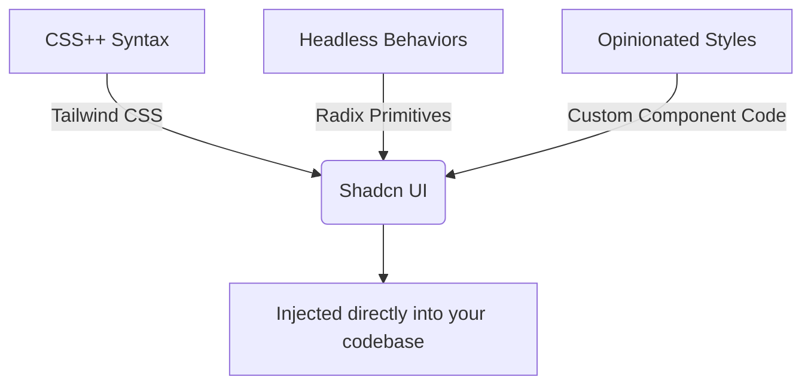

# The Future of Shadcn and Radix: Is it a Liability?

Theo tackles a controversial but important claim from CJ, a trusted Create T3 App contributor and lead frontend developer at Axiom. CJ recently suggested that building applications on top of Shadcn and Radix has become a liability due to stagnant maintenance. Theo agrees that the concerns are deeply valid but offers a nuanced perspective on what developers should actually do in response.

### Understanding the UI Abstraction Layer

To explain why this drama matters, Theo breaks down how modern UI libraries are structured. Historically, he groups them into three distinct pillars: CSS syntax improvements, headless behavior management, and opinionated styling. 

Shadcn is uniquely powerful because it combines Tailwind for styling and Radix for complex browser behaviors like focus management and accessibility. However, instead of hiding these behind an npm package, Shadcn acts as a distribution system that injects the core code straight into your repository, giving you total ownership. Because Shadcn relies so heavily on Radix for its underlying logic, the health of the Radix project directly impacts anyone using Shadcn.

### Why Radix is Facing Criticism 

Radix was originally built at a startup called Modulz. It eventually grew past headless primitives into themes, and the team was later acquired by WorkOS. WorkOS primarily utilized the Radix team to build AuthKit, a highly successful authentication component system. However, once that specific scoped work was finished, many of the original Radix maintainers moved on to new projects. 

This transition has led to several critical problems that developers are starting to notice at scale:
* Many original developers left to build Base UI, dramatically slowing down Radix updates and leaving the project with hundreds of unresolved issues and unmerged pull requests.
* The bus factor for Radix is currently dangerously high, relying almost entirely on a single highly skilled maintainer—Chance at WorkOS—to keep the massive project afloat.
* Teams pushing the framework to its limits, like Axiom rendering millions of rows of data, are hitting severe performance bottlenecks due to unoptimized code in Radix. 
* Radix possesses deeply embedded bugs, such as `useEffect` hooks missing dependency arrays, which safely cause infinite re-renders or crash applications when rendering dozens of tooltips on a single page.
* Surprisingly, Colm, the original co-creator of Radix, openly agrees with the liability claims and advises developers against using Radix for any serious new projects.

### Exploring Alternative Frameworks

Theo discusses several alternative libraries that the community and former Radix developers are pointing toward as successors:
* Base UI is emerging as the clearest direct successor, being actively built by former Radix developers alongside creators from Floating UI and Material UI. 
* React Aria, built by Adobe, remains an incredibly stable and exceptionally well-maintained option for headless component architecture.
* Aria Kit provides excellent headless behaviors, though Theo warns it heavily relies on a single developer, carrying similar bus factor risks to Radix. 

### Shadcn's Response and Theo's Conclusion

In response to the community panic, the creator of Shadcn stepped in with practical advice that Theo firmly echoes. Shadcn insists that migrating away from your current component library just to chase a new one is the worst thing you can do for an existing production app. Every codebase has bugs, and migrating from a battle-tested library like Radix to something currently in beta, like Base UI, replaces one set of known problems with an entirely new set of unknown bugs. 

For new projects, Shadcn recommends evaluating React Aria, Aria Kit, or sticking with Radix while keeping a close watch on Base UI. 

Theo concludes that while Radix's maintenance issues are a genuine liability, Shadcn's localized architecture saves the day. Because Shadcn places the component code directly into your repository rather than burying it inside a node module, developers have the freedom to git-patch bugs themselves. If Base UI eventually becomes the definitively better standard, Shadcn acts as a swappable layer, meaning the community can likely use automated scripts to seamlessly migrate their local components away from Radix in the future.
