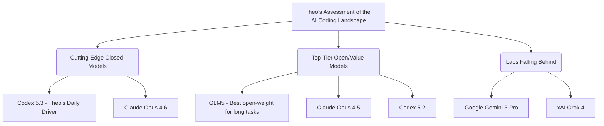

# GLM5 Review: The New Open-Weight Code Leader

Theo introduces GLM5, an open-weight model from the Chinese AI lab Zai, as the absolute best open-weight model he has seen for coding. While it does not dethrone the absolute cutting-edge closed models like Opus 4.6 or Codex 5.3, he finds it incredibly capable. Based on his testing, GLM5 is neck-and-neck with highly capable models like Codex 5.2 and Opus 4.5, and completely outclasses Google's Gemini 3 Pro. 

Theo tested GLM5 extensively using the Kilo CLI and Zai's own Zcode desktop app. His most demanding test was throwing the model at "Ping," an old codebase of his heavily reliant on outdated dependencies. 

*   GLM5 successfully ran an automated, autonomous refactoring job for nearly an hour without failing, a feat Theo notes is completely unprecedented for an open-weight model.
*   The model exhibits excellent Git etiquette during long tasks, independently making commits, creating branches, and unblocking itself via novel packaging patches.
*   Theo views this deep, multi-step problem solving as a validation of "agentic engineering," noting the industry is heavily shifting away from casual "vibe coding" toward this type of long-horizon AI work.
*   At roughly $3 per million output tokens, GLM5 provides massive cost savings. Theo estimates his hour-long code migration would have cost over $100 using state-of-the-art closed-weight models, but only cost about $10 using GLM5.

Theo breaks down the specific architecture and benchmark performance that makes GLM5 so effective for developers.

*   The model has scaled massively to 744 billion total parameters, meaning it cannot be run locally on a home computer and relies on cloud providers like Modal, Cerebras, or Groq for hosting.
*   It utilizes a Mixture of Experts architecture with 40 billion active parameters per prompt, ensuring it only processes the data specifically relevant to the request.
*   It integrates DeepSeek's sparse attention and a novel asynchronous reinforcement learning infrastructure called "Slime" to maintain high efficiency and long-context capabilities.
*   In SWE-bench verified and terminal benchmarks, GLM5 ties with top Anthropic models, beats Codex 5.2, and crushes Gemini 3 Pro.
*   While AI models generally still struggle heavily with complex backend tasks, completing them only 26% to 27% of the time, GLM5 handles frontend development flawlessly with a 98% success rate.
*   According to Artificial Analysis, GLM5 has the lowest hallucination rate ever recorded for an LLM (around 30%, compared to Gemini 3 Pro's 88%), because the model is highly willing to abstain and admit ignorance rather than invent false information.

### Limitations and Industry Impact

Despite high praise, Theo points out that GLM5 has one glaring flaw: a complete lack of vision or multimodal support. Because Theo pastes screenshots or UI mockups in up to half of his prompts, not being able to show the model a visual error is a major bottleneck. However, despite this inability to "see," GLM5 still generates shockingly good front-end UI designs when prompted to write React and Tailwind code from scratch. 

Theo concludes that while Codex 5.3 will remain his daily driver for now, GLM5 proves that top-tier intelligence is being rapidly commoditized. He notes with surprise how quickly smaller and international labs—like Zai, DeepSeek, and Moonshot—are moving. Because they are consistently matching or beating previous state-of-the-art closed models, Theo believes they are permanently altering the industry landscape while massive players like Google and xAI continue to fall strictly behind.
