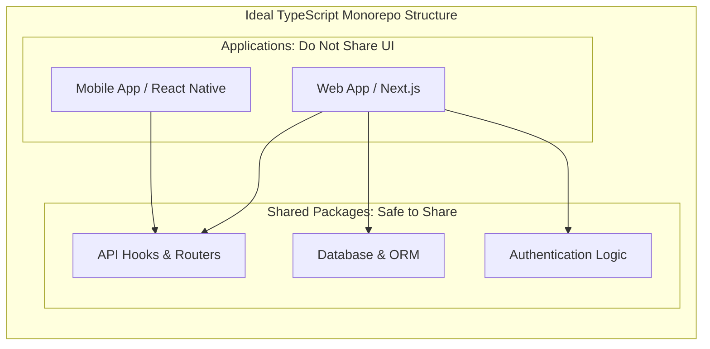

# Why a Massive Startup is Moving from TypeScript to C# (and Theo's Take)

TypeScript has been instrumental to modern web development, and Theo firmly believes it is an incredible tool that he owes much of his success to. However, he acknowledges that operating TypeScript at a massive scale comes with significant growing pains. He recently reviewed a highly detailed engineering blog post from Motion, a task management startup, explaining why they are moving their backend off of TypeScript and onto C#. 

Theo praises Motion's engineering team for their thoughtful, realistic approach to technology choices. Rather than producing a purely negative critique of TypeScript, Motion clearly outlined the specific codebase scaling limits they hit and the reasons they believe C# is the right path forward for their enterprise backend.

### The Illusion of Universal Code Sharing

Motion built a massive 2.5 million line TypeScript monorepo utilizing Turborepo. Their initial dream was full-stack nirvana: sharing code seamlessly across a React web app, a React Native mobile app, an Electron desktop app, their backend APIs, and even their infrastructure via Pulumi. 

Over time, Motion realized that sharing code perfectly across all these platforms was a frustrating illusion. Theo strongly agrees with this finding and notes that developers fundamentally misunderstand the purpose of React Native. React Native was built by Meta so web developers could easily add native features to mobile apps, not so a single codebase could run identically on every platform. 

Theo advocates for a specific mental model when structuring monorepos for web and mobile. You can and should share business logic, but you will ruin the user experience if you try to share visual components.

### Navigating TypeScript's Growing Pains

Motion suffered from what Theo categorizes as "codebase scaling" issues rather than standard traffic or performance bottlenecks. Their CI pipelines were taking 20 minutes, language servers frequently crashed, and dealing with linting rules required heavy processing time. 

Motion also ran into CPU bottlenecks on mobile, maxing out at 190% CPU on complex calendar views because of the constant data-fetching trips between the JavaScript layer and the native device layer. Theo points out that this is a common architectural flaw when nested components fetch their own data independently, necessitating too many heavy hops across the React Native bridge. Motion solved this elegantly by defaulting to React Native for rapid feature iteration, but rewriting heavily bottlenecked views in pure native code—a strategy Theo highly respects.

On the backend, Motion struggled immensely with TypeScript ORMs. They found Prisma slow and buggy—specifically noting an issue where Prisma would delete an entire table if a `where` statement evaluated to perfectly undefined—and felt Drizzle was simply too early in its lifecycle to bet a massive enterprise on.

While Theo notes that the open-source community is actively fixing these DX issues right now with tools like Biome, Zod v4, and the upcoming TypeScript Go rewrite, he fully sympathizes with Motion's core argument. A rapidly scaling startup cannot hang the fate of its business on waiting for community tools to fundamentally rewrite their architectures. 

### Points of Disagreement

While Theo agrees with the vast majority of Motion's engineering assessments, he pushes back on a few specific conclusions they used to justify the move away from the JavaScript ecosystem.

*   **The necessity of input validation:** Motion argued that tools like Zod are only required because JavaScript lacks runtime types, but Theo counters that every application requires strict input validators when data crosses a network boundary from one computer to another, regardless of the language used.
*   **Event loops versus multi-threading:** Motion looked forward to C#'s multi-threading to handle standard CRUD operations without complex workflow orchestration, but Theo argues that Node's single-threaded event loop is actually vastly safer and better equipped for handling scale on I/O-heavy CRUD applications.
*   **Sandboxing requirements:** Motion claimed they needed to move off Node because they required a secure environment to execute arbitrary, user-generated JavaScript for AI agents. Theo finds this reasoning weak, pointing out that secure sandboxing is universally difficult and can be achieved just as effectively using isolated environments connected to a Node server.
*   **Infrastructure tradeoffs:** Theo warns that moving to an enterprise language like C# or Java trades codebase scaling issues for infrastructure scaling issues. TypeScript paired with modern serverless tools scales horizontally with incredible ease, whereas transitioning to .NET requires a team to manually manage load balancers, Kubernetes clusters, and complex provisioning.

### Why Motion Chose C#

When choosing a new backend language, Motion wanted a statically typed, garbage-collected language that maximized developer productivity. They landed on C# and the .NET ecosystem for several highly practical reasons.

First, they were blown away by Entity Framework. As an ORM, it easily handles enterprise use cases right out of the box, featuring global query filters for single-line soft deletes and automatic change tracking without manually plumbing transactions through every repository layer. 

Second, C# syntax feels incredibly familiar to TypeScript developers. Because both languages were heavily shaped by language designer Anders Hejlsberg, concepts like async/await, arrow functions, and nullable types translate almost directly, minimizing the velocity hit for transitioning engineers.

Finally, Motion discovered that AI coding assistants perform exceptionally well with C#. Because the ecosystem has incredibly rigorous compiler guardrails and built-in linting rules that force XML documentation on public methods, tools like Claude can execute advanced generation tasks over longer periods with significantly less human oversight than they require in TypeScript.
