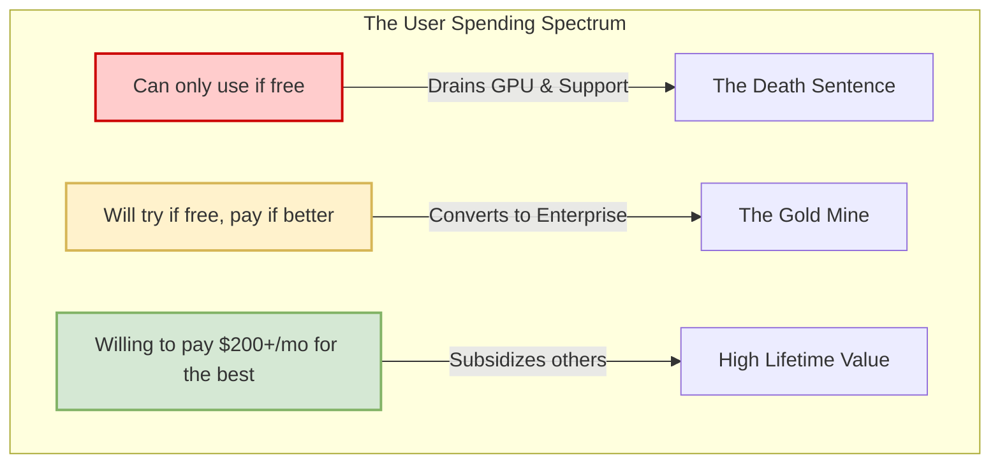

# The End of Free AI Compute: Why the Subsidization Era is Crashing

Theo points out a massive shift happening right now in the AI industry: the era of heavily subsidized and entirely free AI access is rapidly coming to an end. Google recently began heavily restricting free-tier users on Gemini Pro and limiting access for GitHub Copilot student accounts. According to Theo, this cut-off was inevitable. Producing AI responses requires expensive hardware and massive amounts of electricity, and the business strategies that allowed companies to give this away for free are starting to buckle under reality.

### The Core Problem with Pricing AI Compute

Theo explains that giving users access to raw computing power is incredibly difficult to price fairly. Because average users do not understand token-based billing, companies lean toward flat-rate subscriptions like $20 a month or billing per message. 

However, flat-rate pricing hides the staggering variance in actual computing costs. While a simple math question might use 11 tokens, asking an AI model to read a codebase or write 15 poems includes reasoning paths, tool calls, and massive context windows. Theo notes from his experience running T3 Chat that the cost difference between a simple message and a complex message is roughly 400x. A single prompt from a user on an $8-a-month plan can cost the host a full dollar in API fees. Furthermore, even though the raw cost per token has dropped over the last year, user expectations have scaled exponentially. The massive increase in context length and reasoning features means AI calls require more time on scarce GPUs, ultimately driving overall costs up.

### Why Companies Subsidize (And Why It Fails)

Theo breaks down the three main reasons AI companies have historically swallowed these massive compute costs, and why the math no longer works.

*   **Advertising doesn't cover it:** Many assume companies can offer free AI because they show ads. Theo breaks down his own YouTube metrics to disprove this. His channel receives about 465,000 watch-hours a month from high-value tech demographics, pulling in roughly $9,000 in ad revenue. That equates to fractions of a penny per view. An ad cannot offset an AI prompt that costs a dollar to generate. 
*   **Data collection is only somewhat valuable:** Companies want user chat logs to train future hardware. Chinese bootleggers and AI wrappers often subsidize API keys just to harvest prompt data. However, Theo argues that the data generated by users who refuse to pay for a subscription generally lacks the quality needed to train advanced models. 
*   **Stealing market share (The land grab):** The actual reason companies subsidize inference is to lure customers away from competitors. If a company's model isn't decidedly better than OpenAI's, they make it cheaper or free. They hope users will fall in love with the ecosystem and eventually become paying, enterprise-level customers.

To illustrate the danger of the "land grab" strategy, Theo maps out user behavior. If a company attracts users who are willing to pay for a better product after trying it for free, they strike a gold mine. However, if a product simply attracts users who are completely unwilling or unable to pay, the company falls into a resource-draining trap.

### How the Big Players are Reacting

Theo observes that the way AI platforms are managing their subsidies reveals their long-term strategies and current panic levels.

*   **Google isolated the wrong demographic:** By offering overly generous free access to Gemini, Google successfully attracted users, but largely captured the "death sentence" demographic—students and hobbyists who will never spend money. These free users hogged so much server space that paying Google customers couldn't even access premium models. Google is now aggressively scaling back because their internal teams are fighting over limited compute.
*   **Anthropic is increasing subsidies but locking the doors:** Anthropic offers high-tier users incredibly generous compute limits (up to $5,000 worth of compute on a $200 plan). They know they lose money on power users today, but rely on enterprise teams where 80% of employees rarely use the tool to balance the spreadsheet. Because they need immense lifetime loyalty to make this profitable, they are aggressively deploying lawyers to shut down third-party plugins that give developers the freedom to easily swap away from Claude models.
*   **OpenAI is leveraging their massive lead:** Because OpenAI controls a dominant share of the $20-a-month consumer market, they have the financial cushion to offer temporary 2x rate limits and support open-source wrappers. They want to be positioned everywhere to choke out Anthropic. However, Theo expects OpenAI to violently lock down their ecosystem if they ever secure more than 50% of the market.

Theo concludes by urging developers to take full advantage of these incredibly generous, high-tier API subscriptions while they last. The current ecosystem allows individuals to pull immense value relative to what they actually pay, but as companies wake up to the true costs of hardware and compute, these heavily subsidized plans will disappear.
