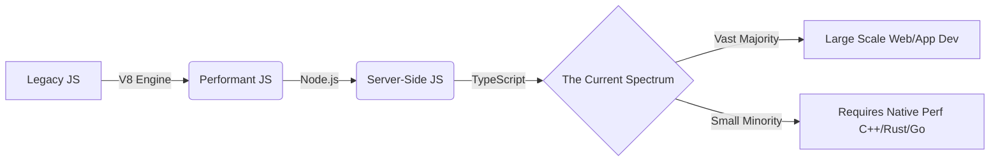

# The Future of TypeScript: From JavaScript Port to Go Native

Theo loves TypeScript. It transformed web development from a frustrating experience into something he genuinely enjoys by bringing much-needed correctness and reliability to JavaScript. However, as TypeScript has grown to dominate the web ecosystem, it has buckled under its own weight. Now, the language is undergoing a massive architectural shift to solve its most glaring problem: speed.

### The Problem with Success

TypeScript was originally created by Microsoft to make writing JavaScript viable for giant monolithic applications. At the time, there was a strict divide in programming: JavaScript was for simple web interactions, and "real languages" were required for everything else. 

Over time, advancements like the V8 engine, Node, Electron, and TypeScript completely shifted that paradigm. TypeScript solved the reliability problems of JavaScript, pushing the boundary of what the language could do. Developers are now using TypeScript for massive full-stack applications and even completely unintended uses, like generating frames of the game Doom entirely within the type system. 

Because TypeScript solved these problems so well, codebases grew exponentially. The issue today is that the TypeScript compiler is incredibly slow. The language itself is defined in a single 55,000-line file that often crashes text editors. Furthermore, JavaScript is fundamentally terrible for writing compilers. JavaScript relies on an event loop optimized for asynchronous tasks like database calls, whereas a compiler requires a fixed, top-to-bottom workload. 

### The Port to Go: TypeScript 6 and 7

To fix the speed issue, Microsoft is rebuilding the TypeScript compiler entirely in Go. 

Theo notes that Go is an incredibly smart choice here, specifically over alternatives like Rust. While Go relies on a garbage collector that causes random latency spikes—historically bad for real-time applications—compilers do not care about exact frame rates. Furthermore, Go easily handles parallel, shared-memory multi-threading, which Rust heavily restricts. Go is also flexible enough to model the inherently messy quirks of JavaScript. 

This transition explains the slightly confusing current roadmap for the language:
*   **TypeScript 6 (The Cleanup):** This is intended to be the final version of TypeScript based on the original JavaScript codebase. It focuses on paying off technical debt, deprecating old features, and aligning its behavior exactly with the upcoming Go version. 
*   **TypeScript 7 (The Go Port):** This will be the new foundation. It is fully written in Go, enables parallel type checking, and operates up to ten times faster than the current engine. 

### Key Features and Changes in TypeScript 6

During the video, Theo goes through the beta release notes for TypeScript 6 to highlight the specific alignment changes being made to prepare for the Go transition. 

While reviewing the release, Theo tests a specific recursive generic bug related to arrow functions that plagued him while building his library, UploadThing. He discovers live that the issue still persists for inner-wrapper functions, reaffirming that TypeScript still contains highly specific inference quirks.

Despite his bug remaining, Theo points out several major improvements coming to version 6:

*   **Strict mode is finally mandatory:** The default setup now has strict checking turned on, eliminating the need for developers to manually configure strict settings in every new project.
*   **Stable type ordering:** TypeScript traditionally assigns internal ID numbers to types based on the order they are processed in the document, which breaks parallel processing. TypeScript 6 introduces deterministic IDs so that the upcoming Go version can compile types in parallel across multiple threads without errors.
*   **Subpath imports:** The compiler now natively understands the modern JavaScript specification for `#/*` internal package module routing, reducing the need for arbitrary dot-slash file paths.
*   **Modernized default targets:** The `module` setting now defaults to `ESNext`, `target` defaults to the current year's ECMAScript version, and empty dependency arrays no longer aggressively infer universal types like Node's file system interface.
*   **Aggressive deprecations:** The team is officially removing support for legacy environments like ES5, BaseURL mapping, and AMD modules, as these cannot be easily or cleanly supported in the native Go rewrite.
*   **Direct file execution catches:** Running the compiler on a single specific file intentionally ignores the `tsconfig`, but TypeScript 6 will now throw a clear error letting the user or an automated agent know the config was bypassed.

### The AI Agent Connection

Theo argues that the TypeScript team's current focus is a premier example of how open-source maintainers should build for the future. Instead of constantly looking to add flashy new syntax, Microsoft is prioritizing speed, stable standardizations, and clear error surfacing. 

In a world where AI agents are writing vast amounts of code, fast compiler feedback through the language server protocol and deterministic error tracing are the most valuable features a language can have. Theo concludes that these aggressive speed optimizations and strict architectural cleanups solidify TypeScript as the best possible language for AI-assisted development.
