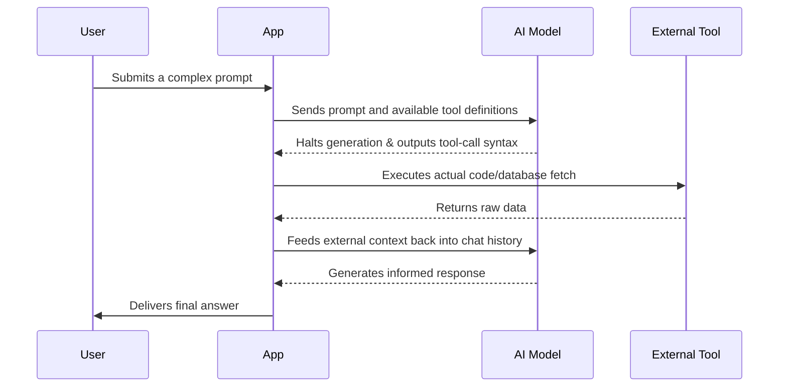

# Why Moonshot's Kimmy K2 is a Massive Leap for AI Tool Calling

Theo argues that the newly released Kimmy K2 model by Moonshot is one of the most important developments in artificial intelligence this year. While it might not be the default model consumers use for everyday chatting, it represents a monumental shift for agentic AI. Theo believes Kimmy K2 will do for tool calling and function calling what DeepSeek R1 did for AI reasoning: permanently elevate the baseline capabilities of the entire open-source ecosystem.

### What is Kimmy K2?

Kimmy K2 is a colossal one-trillion-parameter Mixture of Experts (MoE) model. Because it is an MoE model, each request only activates roughly 32 billion parameters, but physically downloading the open weights from Hugging Face requires a staggering 960 gigabytes of space. Impressively, K2 achieves state-of-the-art results on major coding and agentic benchmarks without even featuring a multimodal or reasoning mode yet. 

Theo highlights that K2 is neck-and-neck with top-tier expensive models like Claude 4 Opus and GPT-4o on benchmarks like SWE-bench and ACEBench. More importantly, it excels on TAU, a benchmark specifically designed to evaluate how well conversational agents utilize tools in a controlled back-and-forth environment. 

### The Tool Calling Monopoly

To understand why K2 is so significant, Theo explains the current landscape of AI tool calling. Tool calling allows a text-based AI to recognize when it needs external data, output a specific syntax, and wait for human-written code to execute a function and return the results before the AI continues its response. 

Before Kimmy K2, Anthropic's Claude models held a massive, unshakeable moat in this space. Theo notes that building complex AI applications requires absolute reliability. If a model has to make five tool calls in a single flow, even a slight drop in reliability compounds exponentially, leading to a broken user experience. 

According to Theo, competing models fall completely flat in this area:
*   Gemini 2.5 Pro frequently announces it is going to use a tool and then simply fails to do so, or hallucinates syntax.
*   Grok 4, though specifically trained on tool calling, tends to hallucinate its own formatting based on its training data instead of adhering to the strict syntax provided by the developer, causing the application to output raw code to the user.
*   OpenAI has historically lagged behind Anthropic in tool reliability, though they are currently working hard to catch up with updates to GPT-4o.

Because of this gap, Anthropic has been able to maintain high API prices without dropping them when new models release. Developers simply could not risk switching to a smarter or cheaper model if it meant their application's tool calling would regularly fail.

### How K2 Breaks the Mold

Kimmy K2 is the very first model Theo has found that matches Anthropic's reliability. When putting it through his own custom evaluations, K2 executed tools with deliberate precision. It never hallucinated syntax, never misused the provided CLI tools, and never produced the formatting errors that plagued Grok and Gemini. It simply followed instructions and used the provided tools correctly every single time. 

However, Theo points out two major catches that prevent K2 from being a flawless drop-in replacement right now:

*   **It is incredibly slow.** Due to the massive parameter size, K2 currently generates text at roughly 15 tokens per second on commercial inference hosts. Compared to fast models moving at over 250 tokens per second, K2 is entirely too slow for real-time consumer chat applications.
*   **The license is legally restrictive.** K2 uses a modified MIT license stating that if a product reaches 100 million monthly active users or $20 million in monthly revenue, the company must prominently display the K2 branding in its user interface. Theo argues this voids its status as true open source and creates complex legal gray areas for companies trying to use third-party inference hosts or distill the model into their own architectures.

### The True Value: Generating Synthetic Data

Despite its slow speed and weird licensing, Theo is incredibly hyped about K2's future impact. You do not need a fast model to generate backend training data. Just as DeepSeek R1 was initially slow but was used to generate millions of reasoning examples to train lightning-fast, smaller models like Llama and Qwen, K2 will serve exactly the same purpose for tool calling.

For the first time ever, the AI community has an economically viable way to generate an near-infinite supply of flawless function-calling data without relying on Anthropic's API (which actively cuts developers off for scraping training data). 

Theo directly addresses skeptics who doubt the efficacy of training models on synthetic data:
*   He cites a 2024 paper from DeepSeek demonstrating that synthetic data generated from mathematical competition problems vastly improved theorem-proving accuracy in LLMs, allowing them to solve problems GPT-4 couldn't touch.
*   He points to Nvidia's DLSS technology, which utilized a fully synthetic training set for high-fidelity graphics upscaling because it was faster and more effective than gathering real-world game data.

Ultimately, Theo concludes that Kimmy K2's real legacy won't be as a consumer chatbot, but as an engine for industry-wide advancement. He envisions a near future where developers take the open-source reasoning data from DeepSeek R1, combine it with the perfect tool-calling data generated by Kimmy K2, and pour it all into upcoming open-weight architectures. This combination of synthetic data pipelines will rapidly decentralize the AI landscape and create tools far more powerful than what the closed-source giants currently offer.
