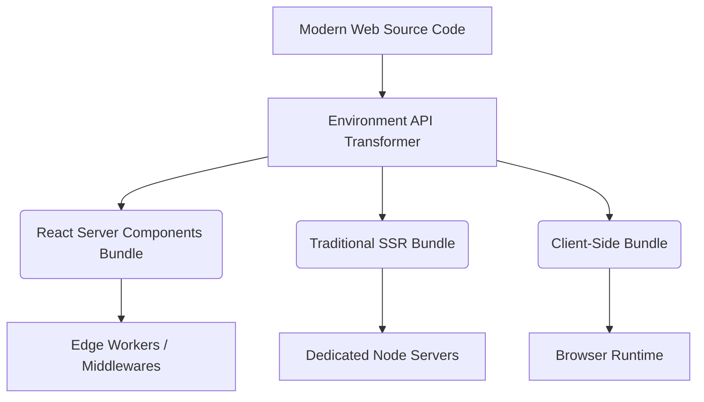

# Vite 6 and the Multi-Environment Future of Web Development

Theo views Vite as the unquestioned standard for modern web bundling, succeeding older tools like Webpack and Snowpack due to its fantastic developer experience. However, since its inception, Vite was fundamentally built with a single execution runtime in mind: the browser. With the release of Vite 6, a major architectural shift addresses this historical blind spot, making it profoundly easier to build full-stack, multi-environment frameworks. 

### The State of Vite and the Bundler Problem
Vite's massive growth continues, having jumped from roughly 7.5 million to 17 million weekly npm downloads in the last year alone. It has gained widespread corporate backing and a dedicated ecosystem, bolstered by companies like StackBlitz. Despite this success, Vite has historically wrestled with structural limitations regarding how it builds and runs code:

*   **The Dev vs. Prod Bundler Split:** Currently, Vite uses `esbuild` during development to quickly bundle files individually, but relies on `rollup` for production to create a practical, consolidated bundle. This forces developers to use two entirely different bundlers, which can lead to inconsistencies between the development machine and production servers.
*   **The Rolldown Dream is Still Pending:** Evan You's new company, Void Zero, is currently building `rolldown`—a powerful Rust-based bundler designed to unify Vite's dev and prod environments with immense speed. However, Theo makes it clear that while highly anticipated, Rolldown is not yet ready and is not the underlying engine switch in Vite 6.
*   **The Multi-Runtime Hack:** Modern web applications do not just run in the browser. A single codebase might execute on an edge worker, a Node server for rendering, and the client browser. Previously, framework authors had to use complex workarounds and tooling (like Vinxi or Nitropack) to force Vite to understand these boundaries. 

### The Core Feature: The Environment API
The defining feature of Vite 6 is the experimental Environment API. Theo argues this is exactly what the javascript ecosystem has been waiting for, as it shifts Vite from a browser-first bundler to a universal runtime orchestrator. 

If you are currently using Vite to build a standard Single Page Application (SPA), Theo notes that these changes will largely go unnoticed, and you should be able to upgrade to Vite 6 with almost zero friction. However, for framework authors, this changes everything.

*   **Solving the Server Component Bottleneck:** When React Server Components (RSC) were announced, they required applications to generate up to three entirely separate bundles: one for the RSCs, one for traditional Server-Side Rendering (SSR), and one for the client. Next.js achieved this by building their own compiler (Turbopack), whereas building this on top of old Vite was nearly impossible. 
*   **Separation of Execution Layers:** Previously, Vite's code transformer was locked into Node and treated SSR simply as running client code on a server one time. Vite 6 decouples these layers, allowing developers to target specific environments seamlessly without clunky workarounds. 
*   **The End of Platform Adapters:** Because Vite can now natively understand different execution environments, framework creators (like Tanner Linsley of TanStack Start or Ryan Carniato of SolidStart) will no longer have to maintain exhausting lists of platform-specific adapters for Vercel, Cloudflare, or Netlify. 

To illustrate how Vite 6 handles complex modern applications compared to earlier versions, the relationship between code layers and environments can be mapped out:

### Community Collaboration
Theo goes out of his way to highlight that this massive leap forward was not built in a vacuum. He credits the Nuxt framework team—specifically Anthony Fu, Pooya, and Vladimir—for doing much of the heavy lifting. Instead of keeping this advanced multi-environment orchestration exclusive to the Vue/Nuxt ecosystem, they worked tirelessly to push it upstream directly into Vite's core. 

Because of this cross-community collaboration, Theo believes we have gone from being years away from a viable, Vite-based alternative to Next.js for React Server Components, to being merely months or weeks away from powerful new framework alternatives.
